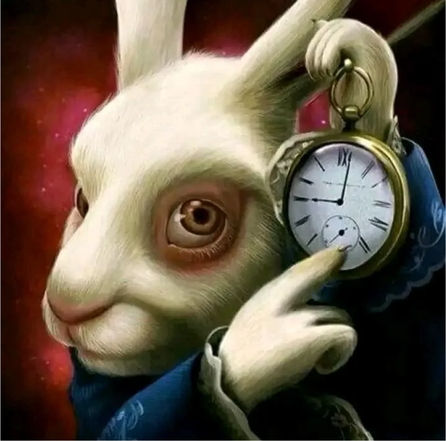
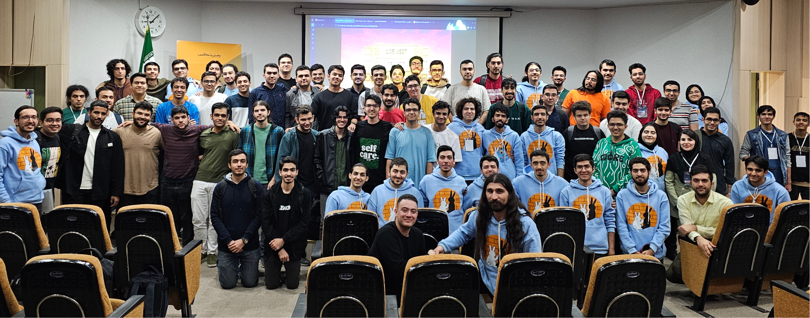
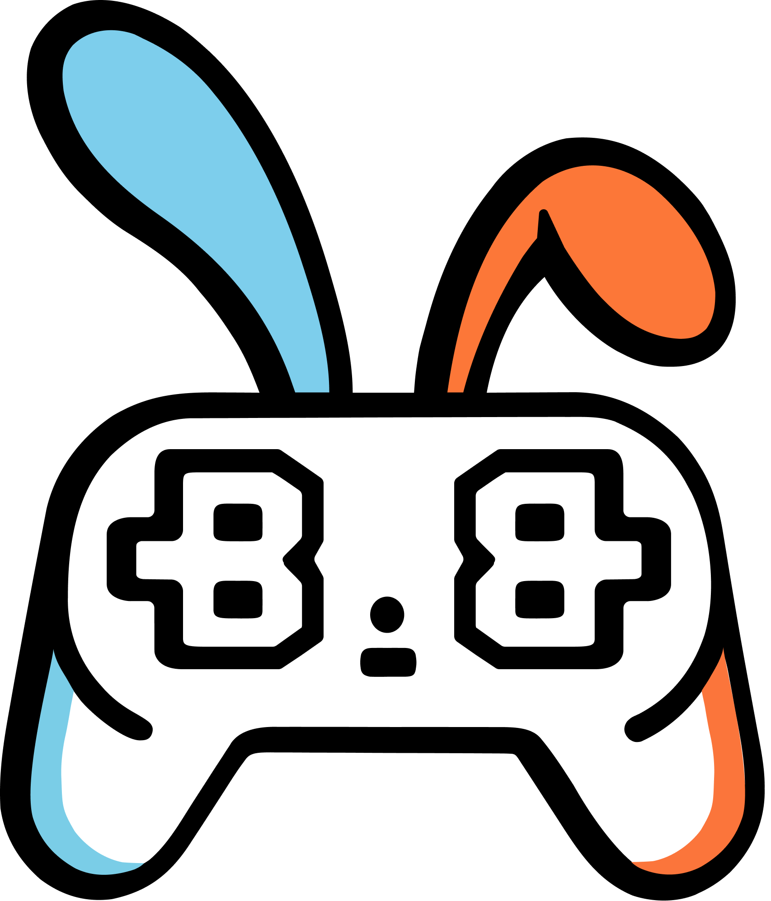
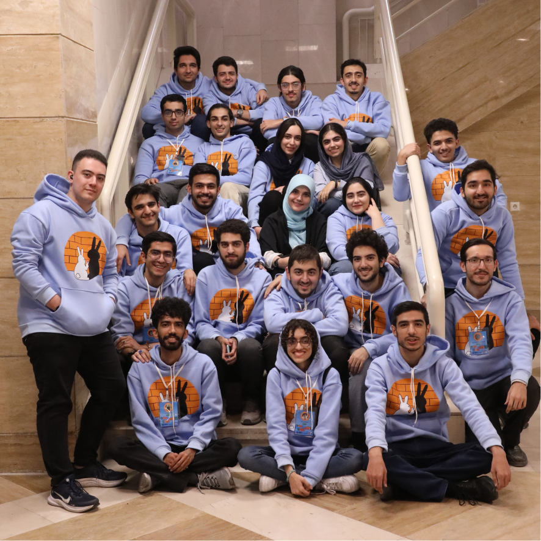

شاید شما هم حس کرده باشید که اگر قرار است رویداد مربوط به بازی‌سازی داشته باشیم اگر  برگزارکنندش قرار نیست دانشکده کامپیوتر باشه پس کجاست. اولین دوره باگزبازی بعد از چند سالی که رویداد بازی‌سازی داخل دانشکده و دانشگاه نداشتیم، آبان و آذر امسال برگزار شد. ولی نکتۀ اصلی ماجرا این بود که باگزبازی با این وجود که اولین دوره برگزاری آن بود خیلی ساده نبود، شامل بخش های متعددی بود و داخل بعضی موارد به سمتی حرکت کرده بود که داخل هیچ رویداد یا گیم‌جمی مشابهش وجود نداشت. در این متن علاوه بر صحبت راجع به جزئیات باگزبازی قرار است یک روایت درونی‌تر از چالش ها و مسیر اولین دوره رویداد نیز ببینیم.

## روز منفی یک: چیشد که این ماجرا شروع شد؟

داستان شروع ماجرا  خودش به اندازه کافی عجیب است. جرقه اولیه شروع آن را می‌توان به مهر ماه پارسال و گیم‌کرفت امیرکبیر که خودم شرکت کردم ربط داد؛ ولی ترجیح می‌دهم از تیر امسال شروع کنم. جایی که دوران بعد از جنگ فرصتی داده بود که با احمز (امیرحسین محمدزاده که یکی از دوستان نزدیک من و عضو انجمن علمی دانشکده‌ است) صحبت های کمی رندوم‌تر داشته باشیم.

احمز از فرم رویداد انجمن علمی برایم گفت و از من خواست پروپوزالی برای یک رویداد بنویسم. یک روز بدون اینکه یک درصد احتمال بدهم قضیه قرار است جدی بشود حدود یک ساعت نشستم و از ‌رویدادی نوشتم که شاید بتوان بچه‌های دانشکده را ترغیب کرد برای مدت کوتاهی بازی و بازی‌سازی داشته باشند. بعد از آن احمز از این موضوع برایم گفت که اتفاقا  مهدی  علی‌نژاد و  امیرمهدی  طهماسبی هم به فکر برگزاری گیم‌جم هستند و خب در  این   نقطه تلاقی ما رخ داد و بعد از آن هسته مرکزی اولیه رویداد شکل گرفت. بر خلاف انتظار اولیه من همه‌چیز در حال جدی شدن بود. یکی از جالب‌ترین بخش های رویداد همان جلسات مجازی بود که آن اوایل سه نفری برگزار می‌کردیم و راجع به ساختار رویداد صحبت می‌کردیم. کم کم بحث های ما جدی‌تر شد و از طرفی مهدی که خودش عضو انجمن علمی بود پیگیری های لازم را در انجمن انجام می‌داد و  این شد رویداد خیلی زودتر از انتظار  من به مرحله اجرایی رسید. اگر یک ماه قبل از آن به من که حتی سابقه استف شدن در رویداد های دانشکده را نداشتم میگفتید قرار است دبیر یک رویداد باشی قطعاً به هیچ عنوان باور نمی‌کردم ولی خب آن روز همه چیز واقعی به نظر می‌رسید.

## روز صفرم : آغاز فعالیت و چکش‌کاری ساختار رویداد

بعد از کش و قوس های فراوانی که برای انتخاب اسم رویداد داشتیم، در نهایت باگزبازی نهایی شد، پیام معرفی رویداد آماده شد، پیام مربوطه حدود نیمه مرداد ماه روی کانال کافه اسسی قرار گرفت و میتوان گفت از آن نقطه بود رویداد به صورت رسمی آغاز به کار کرد.

تیم رویداد به سرعت شکل گرفت و از آن نقطه به بعد چکش‌کاری ساختار رویداد شروع شد. در ابتدا قرار بود رویداد صرفا شامل بخش حضوری که مخاطب هدفش بچه‌های دانشکده خودمان بودن باشد ولی تصمیم گیری به این سمت رفت که حیف است در کنار آن یک گیم‌جم مجازی بزرگ‌تر وجود نداشته باشد. این بود که گیم‌جم و به دنبال آن بخش ارائه‌ها و کارگاه‌ها به رویداد اضافه شدند. رویداد به اندازه کافی بزرگ شده بود و از طرف بچه‌های مختلف ایده‌های جذاب دیگری می‌رسید که بعضی از آن‌ها خودشان پتانسیل تبدیل شدن به یک رویداد کامل را داشتند و یکی از دردناک‌ترین بخش‌های رویداد همین  کنار گذاشتن  ایده‌های جذاب بود ولی در آن نقطه پذیرفتن بعضی ایده‌های قبلی نیز به اندازه کافی ریسک بزرگی بودند و چارۀ دیگری نداشتیم.

## هجوم خرگوش‌ها  1

    

ما قرار بود اولین دوره یک رویداد را برگزار کنیم بنابراین قرار نبود همه‌چیز ساده باشد و چالش های ما از روز های اول وجود داشت.

اولین مشکلی که در مسیر رویداد با آن مواجه بودیم پیدا کردن اسپانسر برای رویدادی بود که برای اولین بار داشت برگزار می‌شود و در مقابل به صورت همزمان گیم‌کرفت امیرکیبر که دورۀ پنجم آن بود نیز وجود داشت. که این مورد  در نهایت با تلاش های تیم اسپانسرشیپ، مخصوصا هد فوق‌العادۀ تیم به نحو احسن رفع شد و خرگوش اول را با موفقیت شکست دادیم.

چالش بعدی مربوط به بحث محتوای گرافیکی رویداد بود که خودش با توجه به حجم زیاد محتوای گرافیکی مورد نیاز و از طرفی اینکه دوره اول رویداد بود به اندازه کافی کار سنگینی بود  که با اضافه شدن اسپانسر و تغییر ناگهانی تم خرگوش بعدی از راه رسید که خودش دشواری های زیادی برای ما به همراه داشت ولی در انتها این خرگوش نیز صورت مویی شکست خورد.

خرگوش بعدی مربوط به سایت رویداد بود که برعکس سایر رویدادها که از سایت دوره‌های قبل یا سایر رویدادها کمک میگرفتند با توجه به نیازمندی های خاص رویداد و همچنین اینکه اولین دوره رویداد بود کار ما بسیار سخت‌تر بود که در این مورد کمی از خرگوش حریف گل هم دریافت کردیم ولی در نهایت با کمی تاخیر سایت ما نیز از راه رسید و می‌توان گفت با این خرگوش نیز تساوی کردیم.

ولی خب این پایان کار خرگوش‌ها نبود. خرگوش‌ها قرار نبود باگزبازی را تنها بگذارند و چالش هایی مثل تاخیر در شروع ترم، تعویق در زمان ورود ورودی های جدید، تاریخ اردوی ورودی و کلی خرگوش دیگر به دنبال شکست باگزبازی بودند.

## روز اول: زنگ شروع رویداد

در نهایت با شکست گروه اول خرگوش‌ها اوایل آبانماه باگزبازی رسماً شروع شد. رویداد قرار بود متشکل از سه بخش اصلی کارگاه‌ها و ارائه‌ها، رقابت حضوری و گیم‌جم مجازی باشد. که هرکدام از بخش‌ها نیز چالش‌ها و جزئیات بخصوص خودش را داشت که در ادامه به صورت خلاصه با جزئیات هرکدام را می‌بینیم.

## کارگاه‌ها و ارائه‌ها

این قسمت خودش نیز شامل دو بخش بود. سری ویدئوهای ضبط شده Godot و ارائه‌های مجازی؛ ویدئوهای ضبط شده برای موتور بازی‌سازی Godot به نوعی مکمل رقابت حضوری بودند. این ویدئوها توسط تیم علمی خود رویداد ضبط شدند و از کیفیت بسیار بالایی برخوردار بودند. در بخش بعدی یعنی ارائه‌های مجازی مجموعاً 15  ارائه با کیفیت در موضوعات مختلف مربوط به بازی‌سازی با همکاری متخصصین حوزه بازی‌سازی و  برگزار شد.

## بازی دانشکده

یکی از ایده‌هایی که در جریان  رویداد مطرح شد، بازی دانشکده بود که نسخه اولیه آن به عنوان یکی از پایۀ بازی‌های آماده در اختیار شرکت‌کنندگان رقابت حضوری قرار گرفت. ولی تیم علمی بعد از رقابت حضوری از توسعه آن دست برنداشت و در نهایت با طراحی یک مرحله جذاب درون فضای بازی یک چالش جداگانه برای آن در طول رویداد نیز تعریف کرد. توضیحات تکمیلی راجع به این بازی را میتوانید در متنی که مهدی علی‌نژاد، هد تیم علمی رویداد، در [وبلاگ بایت](/blog/bugsbuzzy)  نوشته است، بخوانید.

## رقابت حضوری:  تمرکز بر روی دانشکده

این بخش که احتمالا دلیل اصلی به وجود آمدن رویداد بود در  دو روز و به صورت حضوری درون دانشکده برگزار شد. شرکت‌کننده ها در قالب تیم های 2 یا 3 نفره قرار بود با کمک پایه اولیه بازی‌هایی که توسط تیم علمی رویداد آماده شده بود و در اختیارشان قرار گرفته بود  طی این 2 روز بازی‌های خود را ساختند و همچنین در فاز آخر رقابت بازی‌های یکدیگر بازی کردند.

هدف اصلی این بخش این بود تا جای ممکن دانشکده را وارد بازی کنیم و حتی شده برای مدت کوتاهی کاری کنیم بچه‌های دانشکده بازی و بازی‌سازی را تجربه کنند. اولین قدم این بود رقابت را به نوعی طراحی کنیم که کسانی که قبل از این تجربه بازی‌سازی نداشتند هم شانس رقابت داشته باشند. برای این مورد دو کار انجام دادیم. مورد اول سری ویدئو های Godot بود که این امکان را فراهم میکرد کسانی که تا قبل این تجربه خاصی هم نداشتند به سطح خوبی از آشنایی با موتور بازی‌سازی Godot برسند. مورد دوم این بود که سعی کردیم با در اختیار قرار دادن پایۀ چند بازی آماده، مسیر ساخت اولین بازی آن‌ها را برایشان هموار کنیم.

قدم بعدی این بود جدیت رقابت را تا جای ممکن کم کنیم و سعی کنیم رقابت شکلی بگیرد که بتواند برای همه جذابیت خود را داشته باشد. اولین کار ما در این مسیر این بود که به جای قرار دادن صرفا چند جایزۀ بزرگ، جوایز را به قسمت های کوچکتر شکستیم و برای بخش‌ های مختلف جوایز جداگانه قرار دادیم که شانس همه برای برنده شدن افزایش پیدا کند. قدم دوم این بود خود طراحی مسابقه را به سمتی ببریم که جذابیتش برای همه افزایش پیدا کند برای این مورد یک فاز رویداد را کاملا به بازی کردن اختصاص دادیم و حتی جوایزی مخصوص این فاز نیز قرار دادیم.

با این همه ولی از آنجایی که دوره اول  برگزاری رویداد بود در بسیاری از موارد همه چیز مورد انتظار ما نبود و در بعضی از بخش‌ها به جای هجوم خرگوش‌ها با هجوم فیل‌هایی روبه‌رو شدیم که به دنبال فیل۱ کردن رویداد بودن. چالش‌هایی مثل آماده کردن بازی همۀ تیم‌ها برای فاز آخر که با تاخیر مواجه شد یا نا امید شدن و کنار کشیدن برخی تیم‌ها در میانۀ راه که انتظار آن را نداشتیم. ولی در نهایت، با وجود اینکه دورۀ اول رویداد بود تا حد خوبی این فیل‌ها کنترل شدند و تجربه‌های خوبی برای دوره‌های بعدی  در صورت وجود کسب شد.

    

## هجوم خرگوش‌ها 2

بعد از سختی های رقابت حضوری گروه دیگری از خرگوش‌ها آماده بودند تا نگذارند حتی برای مدتی کوتاه تیم باگزبازی آب خوش از گلویش پایین برود. بزرگترین چالش ما برای گیم‌جم، تعداد ثبت‌نامی‌های آن بود. ثبت‌نام گیم‌جم مجازی ما همزمان با ثبت‌نام رقابت حضوری آغاز شده بود و به طور کلی تعداد بخش‌های زیاد رویداد و این مورد که تمرکز ما در ابتدای روی بخش حضوری بود؛ باعث شده بود مخاطب تا حد زیادی گیج بشود و در آن نقطه تعداد تیم‌های ثبت‌نامی ما فقط به اندازه انگشتان یک دست بود.این خرگوش‌ها قوی‌تر از چیزی بودند که در نگاه نخست به نظر می‌رسد. یکی از مهم‌ترین ملاک‌ها و شاید مهم‌ترین ملاک که میتواند به افزایش کیفیت و اعتبار یک گیم‌جم کمک کند قطعاً میزان شرکت‌کنندگان آن است. ما بسیاری از فرصت‌های مارکتینگی خود را از دست داده بودیم و با مخاطبی که گیج شده بود مواجه بودیم.

پوستر با تم جدید طراحی کردیم، سبک و سیاق پیام‌های کانال را عوض کردیم  و استقلال گیم‌جم و رقابت حضوری را برای مخاطب تفهیم کردیم. کار ما به همین موارد ختم نمیشد؛ مسئول هماهنگی رویداد، نیز با کمک تیم مارکتینگ هر راه نرفته‌ای که در حوزه مارکتینگ وجود داشت را طی کردند تا خرگوش‌ها  پیرو‌ز ماجرا نباشند. کمک گرفتن از رسانه های حوزۀ بازی، هدف قراردادن کانال‌ها و گروه‌های مربوط به بازی‌سازی، کمپین‌های مارکتینگی جدید از جمله کارهایی بود که ما برای شکست خرگوش ها انجام دادیم. در نهایت میتوانم به جرئت بگویم تیم باگزبازی برنده بلامنازع این نبرد در مقابل خرگوش‌ها بود.

## گیم‌جم مجازی: فراتر از انتظار ما و پر از چالش

احتمالا بهتر است اول توصیف کوتاهی از خود این موضوع که ذاتاً گیم‌جم چیست ببینیم؛ «گیم‌جم یک رویداد فشرده و متمرکز برای ساخت بازی است که تیم‌ها در یک بازۀ زمانی کوتاه و بر اساس تم مشترک بازی خود را خلق میکنند.»

مرحلۀ اول، انتخاب تم بود که بعد از چند جلسه با تیم علمی تصمیم گرفتیم تم را سفر به فضا قرار بدهیم. کار دیگری که راجع به تم انجام دادیم این بود که به جای اینکه صرفا یک جمله یا کلمه را تم قرار دهیم، یک عکس برای تم در نظر بگیریم تا افراد مختلف بتوانند با برداشت های مختلف خود از تم بازی های خود را بدون محدودیت خلق کنند.

مدت زمان گیم‌‌جم باگزبازی 10 روز تعیین شد و افراد میتوانستند به صورت انفرادی یا در قالب تیم های 2 تا 6 نفره در گیم‌جم شرکت‌کنند؛ در مورد میزان استقبال از گیم‌جم نیز با شکست خرگوش هایی که در بخش قبل راجع به آن‌ها صحبت کردیم تعداد ثبت‌نامی های گیم‌جم باگزبازی به 120 تیم و 350 نفر رسید که هم نسبت به رویداد‌های مشابه عدد بسیار بالایی بود و هم تا حدی فراتر از انتظار خود ما بود.

در  نهایت نیز 72 بازی برای داوری ارسال شد که تعداد خوبی از آن‌ها کیفیت بسیار بالایی داشتند.  البته این تعداد بازی خوب نیز خودش خرگوش جدیدی بود که آمده بود کار داوری را برای ما سخت‌تر کند و باعث شده بود چالش جدیدی برای ما ایجاد شود. در اینجا نیز ما با چند مرحله‌ای کردن فرایند داوری و افزایش تعداد داوران سعی کردیم دقت داوری را افزایش و از طرفی تاثیر نظر شخصی را هم تا حد خوبی کاهش دهیم.

مرحله آخر گیم‌جم، اختتامیه آن بود که حتی آن هم قرار نبود بدون چالش برگزار شود. در ابتدا آلودگی هوا و تعطیلی دانشگاه باعث شد ما مجبور شویم اختتامیه را به تعویق بیندازیم و بعد از آن سوختن سیستم صوتی سالن ربیعی شب قبل اختتامیه چالش‌های بعدی ما بودند؛ درنهایت این خرگوش‌ها را نیز به هر نحوی بود شکست دادیم و اختتامیه را با کیفیت خوبی برگزار کردیم و از برگزیدگان گیم‌جم تقدیر کردیم.

## روز دوم: تجربه‌ها

برگزاری یک رویداد جدید از اولش هم مشخص بود قرار نیست خیلی ساده باشد؛ منطقاً این سختی راجع به باگزبازی که خودش شامل بخش‌هایی بود که به طور مستقل میتوانستن یک رویداد کامل باشند چند برابر بود. نکته مهم ولی میراثی بود که برای دوره‌های بعدی رویداد به جا گذاشتیم و تجربه‌هایی بود که کسب کردیم.

دوره‌های بعدی رویداد در صورت وجود قرار نیست با خیلی از خرگوش‌هایی که ما با آن‌ها جنگیدیم دوباره بجنگند. با همۀ مسائل پیش آماده با برندی که در دورۀ اول ساخته شد قطعا خرگوش پیدا کردن اسپانسر یا مسائل مورد نیاز برای مارکتینگ خیلی ضعیف‌تر از خرگوش هایی هستند که ما با آن‌ها جنگیدیم.

    

ولی شاید مهم‌تر از این مسائل تجربه‌هایی بود که از اولین دوره باگزبازی کسب کردیم. متوجه شدیم در خیلی موارد قرار نیست برنامه‌ریزی‌ها درست جواب بدهند و همیشه سنگی از آسمان (یا شاید خرگوشی از زیرِ زمین) می‌تواند نازل شود. فهمیدیم افزایش پیچیدگی بعضی از موارد می‌تواند خیلی گران‌تر از آن چیزی که انتظارش را داریم تمام شود. دیدیم فرسایشی شدن خیلی از موارد میتواند انگیزه‌ با انگیزه‌ترین اعضای رویداد را هم از آن‌ها بگیرد.  ولی همچنین دیدیم در تاریک‌ترین نقطه‌ها می‌شود راهی برای نجات و بقا پیدا کرد.

به طور کلی شاید بتوان از تجربه‌ها و مسائلی که باگزبازی در طول مسیر خود با آن‌ها مواجه شد یک کتاب کامل نوشت. ولی فارغ از همۀ مسائل مهم‌ترین نکته شاید این نکته باشد که فارغ از تمام اتفاقات و نگاه‌های مختلفی که از بیرون راجع به شکست یا موفقیت اولین دورۀ باگزبازی میتواند وجود داشته باشد؛ در پشت‌صحنه، باگزبازی تا آخرین لحظه ایستاد و جنگید.

## خرگوشت را قورت بده

روزی که داشتم به عنوان دبیر رویداد انتخاب می‌شدم از آنجایی که تا آن روز حتی استف سادۀ هیج رویدادی نبودم ترسی برای قبول کردن دبیری داشتم. ولی چیزی که به من چشمک میزد تجربه‌ جذابی بود که حس میکردم نباید از دستش بدهم. مسیر دبیری اصلا ساده نبود و حتی در خیلی از موارد بسیار سخت‌تر از آن چیزی بود که انتظارش را داشتم. در بعضی موارد مجبور شدم از درسم بزنم، کلاس‌هایم را شرکت نکنم و حتی برای رویداد بی‌خوابی بکشم.

ولی بازهم اگر از من بپرسند ارزشش را داشت پاسخم قطعا مثبت خواهد بود. اگر در 20 سالگی قرار نیست این ترس‌ها را کنار گذاشته و در بعضی موارد از چارچوب‌های امن خود خارج شد پس کی زمان آن است؟ با همه  سختی قطعاً آورده‌های این مسیر برایم خیلی بیشتر بوده‌است. میخواهم حرف‌های کلیشه‌ای مانند یادگیری و تجربه کار تعاملی و تیمی که کاملاً هم برایم صدق میکنند را کلاً کنار بگذارم. تجربه‌های جذابی که در طول مسیر داشتیم را هم حتی اگر کنار بگذاریم. مهم‌ترین آورده این رویداد آشنایی من با افراد و دوستان جدیدی بود که اگر این رویداد نبود شاید هیچ‌وقت شانس دوستی و تعامل باهم را پیدا نمی‌کردیم.

    

ماندن در حاشیۀ امن و طی کردن روند عادی زندگی شاید گزینه کم ریسک‌تری به نظر برسد ولی قطعاً بهترین گزینه نیست. دوران دانشجویی احتمالا بهترین فرصت شما برای انجام کار‌های جدید و کسب تجربه‌های جذاب است.پس سعی کنید در بعضی موارد فارغ از ترس از نتیجه کار و حرف دیگران به دنبال کسب تجربه‌های جذاب باشید. تا زمانی که فرصت آن را دارید و می‌توانید خرگوشتان را قورت بدهید شاید فردا دیگر خرگوشی برای قورت دادن نداشته باشید.
