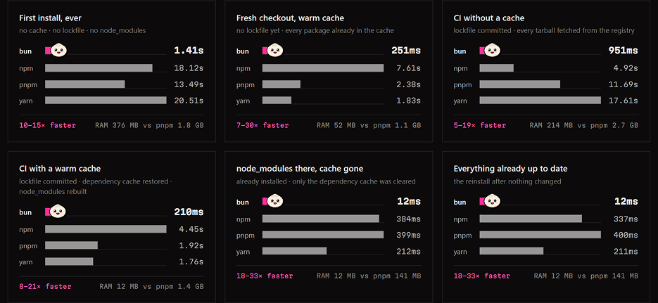
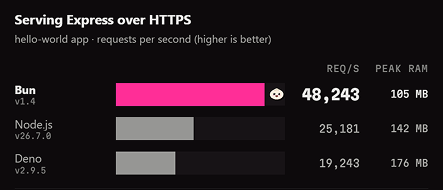
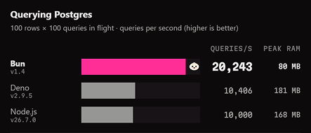
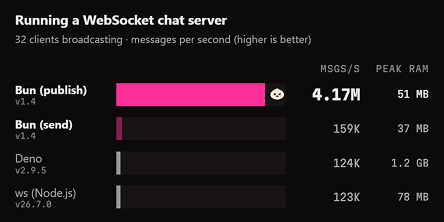

اگر مدتی در دنیای JavaScript برنامه‌نویسی کرده باشید، احتمالاً میز کارتان با ابزارهای مختلفی شلوغ شده‌است: یک Runtime برای اجرای برنامه، یک Package Manager برای نصب وابستگی‌ها، ابزاری برای تست، ابزاری برای Bundle کردن و شاید چند ابزار دیگر برای توسعه و انتشار پروژه. این تنوع یکی از قدرت‌های اکوسیستم JavaScript است؛ اما گاهی همین قدرت، پیچیدگی ایجاد می‌کند. برای راه‌اندازی یک پروژه نسبتاً ساده ممکن است مجبور شویم چند ابزار مستقل را نصب، تنظیم، و با یکدیگر هماهنگ کنیم. حالا یک نان تازه از تنور اکوسیستم JavaScript بیرون آمده که می‌خواهد بخش زیادی از این ابزارها را در یک بسته قرار دهد.

Bun یک JavaScript Runtime و Toolkit همه‌کاره است که Runtime، پکیج‌منیجر، Test Runner و Bundler را در یک فایل اجرایی مستقل جمع می‌کند. ایدۀ اصلی آن را می‌توان در سه کلمه خلاصه کرد: سرعت، یکپارچگی و سازگاری. اما آیا Bun واقعاً آن‌قدر سریع است که ادعا می‌کند؟ آیا در پروژه‌های واقعی هم استفاده می‌شود؟ و مهم‌تر از همه، آیا این نان تازه می‌تواند جایی در سفره‌ای پیدا کند که سال‌هاست Node.js بر آن حکومت می‌کند؟

## Bun چیست؟

برای شناخت Bun ابتدا باید مفهوم JavaScript Runtime را بشناسیم. مرورگرهایی مانند Chrome و Firefox محیطی برای اجرای JavaScript فراهم می‌کنند؛ اما برای اجرای JavaScript خارج از مرورگر، مثلاً روی یک سرور، به محیط دیگری نیاز داریم. مشهورترین پاسخ این مسئله در پانزده سال گذشته Node.js بوده‌است. Node.js امکان اجرای JavaScript در خارج از مـــرورگر را فــــــراهم کـــرد و به‌مرور اکوسیستم عظیمی از ابزارها و کتابخانه‌ها پیرامون آن شکل گرفت. Bun نیز یک JavaScript Runtime است، اما نمی‌خواهد فقط جایگزینی برای اجرای کد باشد. در یک فایل اجرایی، چهار ابزار اصلی را در اختیار توسعه‌دهنده می‌گذارد:

- Runtime برای اجرای JavaScript و TypeScript.
- Package Manager به‌عنوان جایگزینی برای npm و yarn و غیره.
- Test Runner به‌عنوان جایگزینی برای ابزارهایی مانند Jest و Vitest.
- Bundler برای کاری که معمولاً ابزارهایی مانند Vite ،esbuild یا Webpack انجام می‌دهند.

نکتۀ مهم این است که برای استفاده از Bun مجبور نیستیم همه این ابزارها را یک‌باره بپذیریم. برای مثال، می‌توان در یک پروژۀ Node.js همچنان Node را به‌عنوان Runtime نگه داشت، اما از `bun install` برای نصب پکیج‌ها یا از `bun test` برای اجرای تست‌ها استفاده کرد. به بیان دیگر، Bun نمی‌گوید میز کار قدیمی خود را دور بیندازید؛ پیشنهاد می‌کند کم‌کم چند وسیلۀ روی آن را با یک ابزار واحد جایگزین کنید.

    

## داخل این نان چه خبر است؟

یکی از تفاوت‌های بنیادی Bun و Node.js به موتور JavaScript آن‌ها بازمی‌گردد. Node.js از V8، موتور JavaScript توسعه‌یافته توسط Google و مورد استفاده در Chrome، بهره می‌برد. Bun به‌جای V8 از JavaScriptCore استفاده می‌کند؛ موتوری که بخشی از پروژۀ WebKit است و Safari نیز از آن استفاده می‌کند. خود Bun نیز عمدتاً با زبان Zig توسعه یافته‌است (البته به تازگی آن را با Rust بازنویسی کرده‌اند)؛ یک زبان برنامه‌نویسی سطح پایین که امکان کنترل دقیق روی حافظه و عملکرد را در اختیار توسعه‌دهنده قرار می‌دهد. اما شاید مهم‌تر از انتخاب بین JavaScriptCore یا Zig، فلسفۀ طراحی Bun باشد. در اکوسیستم سنتی JavaScript بسیاری از ابزارها مستقل از یک‌دیــــگر ساخــــته شده‌انـــــد؛ Package Manager یک پروژه است، Runtime پروژه‌ای دیگر و Test Runner و Bundler نیز مسیر خودشان را دارند. در Bun، این اجزاء از ابتدا برای کار کردن در کنار یک‌دیگر طراحی شده‌اند. برای مثال، می‌توان یک فایل TypeScript را به‌طور مستقیم با دستور `bun run server.ts` اجرا کرد؛ بدون این‌که برای چنین استفاده‌ای به مرحلۀ Build جداگانه یا ابزاری مانند ts-node احتیاج داشته باشیم.

Bun در عین حال، تلاش می‌کند با دنیای Node.js سازگار بماند. از `node_modules` و پکیج‌های npm پشتیبانی می‌کند و بسیاری از API های Node.js را پیاده‌سازی کرده‌است. این موضوع اهمیت زیادی دارد، زیرا ارزش یک Runtime فقط به سرعت اجرای JavaScript نیست؛ کتاب‌خانه‌ها و ابزارهایی که می‌توان روی آن اجرا کرد نیز بخشی از ارزش آن هستند.

## یک نان با چند طعم؛ جعبه‌ابزار Bun

Package Manager شاید یکی از اولین بخش‌هایی باشد که توسعه‌دهندگان بدون مهاجرت کامل به Bun امتحان می‌کنند. `bun install` همان کاری را انجام می‌دهد که معمولاً از `yarn`، `npm install` یا `pnpm install` انتظار داریم و همچنان از اکوسیستم npm استفاده می‌کند. Bun یک Test Runner داخلی نیز دارد. دستور `bun test` برای توسعه‌دهندگانی که با Jest کار کرده‌اند ناآشنا نیست؛ قابلیت‌هایی مانند Snapshot ،`expect()` ،Mock، تست DOM و Coverage در آن وجود دارند. در کنار آن، Bundler داخلی Bun می‌تواند CSS ،JSX ،TypeScript و HTML را برای مرورگر و سرور Bundle کند. حتی امکان Compile کردن برنامه به یک فایل اجرایی مستقل وجود دارد؛ به این معنی که Runtime موردنیاز برنامه نیز همراه آن فایل توزیع می‌شود.

قابلیت‌های داخلی Bun از این هم فراتر رفته‌اند. `Bun.serve()` برای HTTP و WebSocket، کلاینت داخلی SQL برای PostgreSQL ،MySQL و SQLite، کلاینت Redis، دسترسی به فضای ذخیره‌سازی سازگار با S3، ابزار Shell و حتی قابلیت‌های Hashing برای رمز عبور در Runtime قرار گرفته‌اند. فلسفۀ Bun این است که بسیاری از نیازهای رایج یک برنامۀ سرور را بدون اضافه کردن مجموعه‌ای طولانی از Dependency ها فراهم کند.

## Bun واقعاً چقدر سریع است؟

سرعت، احتمالاً معروف‌ترین ادعای Bun است و صفحۀ رسمی آن مجموعه‌ای از Benchmark ها برای اثبات این موضوع منتشر کرده‌است. ابتدا Package Manager را در نظر بگیریم. Bun یک پروژۀ T3 Stack مبتنی بر Next.js با ۲۵ وابستگی مستقیم و حدود ۲۲۰ پکیج در Lockfile را آزمایش کرده‌است. در حالتی که داده‌ها از قبل در Cache موجود هستند، Lockfile وجود دارد و `node_modules` حذف شده، نتیجۀ منتشرشده چنین است:

| ابزار | زمان |
| --- | --- |
| Bun | ۰٫۲۱ ثانیه |
| Yarn | ۱٫۷۶ ثانیه |
| pnpm | ۱٫۹۲ ثانیه |
| npm | ۴٫۴۵ ثانیه |

اما Bun فقط این حالت را آزمایش نکرده‌است. در اولین نصب، بدون Cache و Lockfile و `node_modules`، زمان Bun حدود ۱٫۴۱ ثانیه گزارش شده؛ در مقابل npm با ۱۸٫۱۲، pnpm با ۱۳٫۴۹ و Yarn با ۲۰٫۵۱ ثانیه. در CI بدون Cache نیز Bun حدود ۹۵۱ میلی‌ثانیه زمان ثبت کرده، در حالی که npm حدود ۴٫۹۲، pnpm حدود ۱۱٫۶۹ و Yarn حدود ۱۷٫۶۱ ثانیه زمان نیاز داشته‌اند. حتی در حالت No-op -یعنی زمانی که همه‌چیز از قبل نصب و به‌روز است- Bun زمان حدود ۱۲ میلی‌ثانیه را گزارش می‌کند. Bun این آزمایش‌ها را روی Linux x64 و پردازندۀ AMD EPYC 9R14 انجام داده‌است.

    

## برش دوم بنچ‌مارک؛ HTTP و پایگاه داده

سرعت Package Manager فقط بخشی از ماجراست. Bun عملکرد Runtime را نیز با Node.js و Deno مقایسه کرده‌است. در بنچ‌مارک یک برنامۀ سادۀ Express 5.2.1 روی HTTPS، نتایج رسمی Bun چنین هستند:

    

در آزمایش PostgreSQL با ۱۰۰ کوئری هم‌زمان و مجموع ۱۰۰ هزار کوئری، Bun رکورد ۲۰٬۲۴۳ کوئری در ثانیه ثبت کرده‌است.

    

اعداد قابل‌توجه‌اند؛ اما جذاب‌ترین نمودار Bun هنوز باقی مانده‌است. Bun روی WebSocket تأکید ویژه‌ای دارد. در بنچ‌مارک رسمی یک Chat Server با ۳۲ کلاینت که پیام‌ها را Broadcast می‌کنند، پیاده‌سازی عادی `send` در Bun حدود ۱۵۹ هزار پیام در ثانیه ثبت کرده‌است. اما وقتی از قابلیت داخلی Pub/Sub و `publish` در Bun استفاده شده، عدد به حدود ۴٫۱۷ میلیون پیام در ثانیه رسیده‌است. در مصرف حافظه نیز Bun برای حالت `publish` حدود ۵۱MB گزارش شده‌است.

    

البته عدد ۴٫۱۷ میلیون را نباید بدون توضیح کنار ۱۲۳ هزار قرار داد و نتیجه گرفت «Bun دقیقاً ۳۴ برابر از Node سریع‌تر است». `publish` از مسیــر بهینـــه‌شدۀ داخلــی Pub/Sub در Bun استفاده می‌کند و معماری آن با اجرای یک حلقۀ `send` یکسان نیست.

## از تنور تا Production؛ چه کسانی Bun را واقعاً استفاده می‌کنند؟

شاید این بخش از داستان Bun از نمودارهای Performance هم مهم‌تر باشد. فناوری وقتی جدی می‌شود که از بنچ‌مارک خارج شده و وارد Production شود. صفحۀ رسمی Bun سه نمونه برجستــه را معرفی می‌کند: Midjourney ،Claude Code و Railway.

Claude Code به‌صورت یک Single-file Executable مبتنی بر Bun توزیع می‌شود. Bun Runtime داخل همان فایل قرار می‌گیرد؛ بنابراین کاربر برنامه را دریافت و اجرا می‌کند و نیازی به نصب جداگانۀ Runtime ندارد. نمونۀ دوم، Midjourney است. تمام نوتیفیکیشن‌های تصاویر Midjourney از WebSocket Server مبتنی بر Bun عبور می‌کنند. قابلیت‌های Pub/Sub و Backpressure و فشرده‌سازی پیام نیز مستقیماً در `Bun.serve()` قرار دارند و در این معماری نیازی به `ws` یا Socket.IO نیست. نمونۀ سوم، Railway است که محصول Serverless Functions خود را بر پایۀ Bun ساخته‌است. یک Railway Function می‌تواند به‌طور مستقیم یک فایل TypeScript باشد؛ Bun آن را بدون مرحلۀ Build جداگانه اجرا می‌کند و این موضوع برای محیط Serverless، که زمان Cold Start اهمیت زیادی دارد، جذاب است.

این مثال‌ها اثبات نمی‌کنند که Bun آمادۀ جایگزین کردن Node.js در تمام سازمان‌هاست؛ اما یک چیز را ثابت می‌کنند: Bun دیگر فقط یک پروژۀ آزمایشی و چند نمودار بنچ‌مارک نیست.

## Node.js یا Bun؟

Node.js همچنان مزیتی دارد که با هیچ بنچ‌مارک ساده‌ای اندازه‌گیری نمی‌شود: بلوغ. سال‌ها استفاده در Production، جامعۀ عظیم توسعه‌دهندگان، کتاب‌خانه‌های فراوان، مستندات گسترده و تجربۀ عملی شرکت‌ها باعث شده‌اند Node.js انتخابی کم‌ریسک برای بسیاری از پروژه‌ها باشد. Deno نیز مسیر دیگری را طی کرده‌است و با تمرکز بر Web API ها، TypeScript و طراحی مدرن‌تر Runtime، جایگاه خود را پیدا کرده‌است. Bun اما استراتژی متفاوتی دارد: تا حد امکان با اکوسیستم Node.js سازگار بماند و در عین حال Runtime و ابزارهای اطراف آن را یکپارچه کند.

امــــروزه فریـم‌ورک‌هایــــی مانـنــــد SvelteKit ،Astro ،Nuxt ،Next.js روی Bun اجرا می‌شوند. با این حال «سازگاری با Node.js» را نباید «رفتار کاملاً یکسان با Node.js» معنی کرد. پروژه‌های بزرگ و وابستگی‌های قدیمی همچنان باید قبل از مهاجرت آزمایش شوند و اصلاً لازم نیست انتخاب بین Bun و Node.js صفر و یکی باشد. می‌توان Runtime را Node نگه داشت و فقط `bun install` را امتحان کرد؛ یا Test Runner را جایگزین کرد و بعد دربارۀ مهاجرت قسمت‌های دیگر تصمیم گرفت.

## آیا آینده طعم Bun می‌دهد؟

اهمیت Bun شاید بیشتر از آن‌که در چند عدد Benchmark باشد، در پرسشی باشد که مطرح کرده‌است: «چرا توسعۀ JavaScript باید به این تعداد ابزار مستقل احتیاج داشته باشد؟» Bun پیشنهاد می‌کند Runtime، پکیج‌منیجر، Test Runner و Bundler می‌توانند بخشی از یک سیستم یکپارچه باشند؛ سیستمی که TypeScript را به‌طور مستقیم اجرا می‌کند، Redis ،SQL ،WebSocket و S3 را در اختیار توسعه‌دهنده می‌گذارد و در نهایت حتی می‌تواند برنامه را به یک Executable مستقل تبدیل کند. بنچ‌مارک‌های رسمی آن نشان می‌دهند که این رویکرد در بسیاری از سناریــوها می‌تواند بسیار سریع باشد؛ استفادۀ Midjourney ،Claude Code و Railway نیز نشان می‌دهد این ایده از مرحلۀ آزمایش عبور کرده و وارد Production شده‌است. در طرف مقابل، نتایج مستقل یادآوری می‌کنند که دنیای واقعی پیچیده‌تر از نمودارهای صفحۀ اول یک وب‌سایت است. Bun هنوز با رقیبی مقایسه می‌شود که بیش از یک دهه اکوسیستم و تجربۀ Production پشت سر خود دارد و سریع‌تر بودن یک Runtime در Microbenchmark، به‌تنهایی دلیل کافی برای مهاجرت یک پروژه نیست. پس شاید هنوز برای پرسیدن «آیا Bun جای Node.js را می‌گیرد؟» زود باشد. پرسش جذاب‌تر این است که آیا Bun می‌تواند انتظار ما از یک JavaScript Runtime را تغییر دهد؟ اگر پاسخ مثبت باشد، میراث Bun ممکن است فقط چند میلی‌ثانیه کم‌تر یا چند هزار Request بیشتر نباشد. شاید مهم‌ترین دستاورد این نان تازه این باشد که اکوسیستم JavaScript را مجبور کند دوباره دربارۀ میز شلوغ ابزارهایش فکر کند. فعلاً Node.js همچنان نان اصلی این سفره است؛ اما بوی Bun آن‌قدر در فضای JavaScript پیچیده که دیگر نمی‌شود نادیده‌اش گرفت.

## دستور پخت عوض می‌شود؛ از Zig به Rust

تا این‌جا گفتیم که یکی از مواد اصلی در دستور پخت Bun، زبان Zig بوده‌است. Bun در سال ۲۰۲۱ کار خود را با انتقال Transpiler پروژۀ esbuild از Go به Zig آغاز کرد و به‌مرور بخش بزرگی از Runtime و ابزارهایش نیز با همین زبان توسعه یافت. Jarred Sumner، خالق Bun، حتی تأکید می‌کند که بدون Zig احتمالاً ساخت نسخۀ اولیۀ پروژه‌ای با چنین ابعاد بزرگی در تنها یک سال امکان‌پذیر نبود. اما در سال ۲۰۲۶ اتفاق غیرمنتظره‌ای افتاد: تیم Bun تصمیم گرفت بخش عظیمی از کد Zig پروژه را به Rust منتقل کند. دلیل این تصمیم، کارایــی نبــود. مشکــل اصلی در جایی پنهان شده بود که برای یک Runtime اهمیت حیاتی دارد: مدیریت حافظه و پایداری. JavaScript زبانی با Garbage Collector است و موتور JavaScriptCore نیز قوانین خاص خودش را برای مدیریت عمر اشیاء JavaScript دارد. در طرف دیگر، Zig مانند C مدیریت حافظه را تا حد زیادی به برنامه‌نویس واگذار می‌کند. کنار هم قرار دادن این دو دنیا باعث شده بود تیم Bun مرتب با خطاهایی مانند Use-after-free و Double-free و Memory Leak و Out-of-bounds Access روبه‌رو شود. برای نمونــه، فقط در فهرســت اصــلاحات Bun 1.3.14 چندین مورد Use-after-free در `node:http2` ،`node:zlib` و سوکت‌های UDP، نشت حافظه در بخش‌های TLS و `crypto.scrypt` و حتی Double-free در CSS Parser دیده می‌شد. تیم Bun پیش از مهاجرت نیز اقدامات جدی برای پیدا کردن چنین مشکلاتی انجام می‌داد: اجرای تست‌ها با AddressSanitizer، استفاده از Build های دارای Safety Check، اجرای دائمی Fuzzing و مجموعۀ بزرگی از تست‌های تشخیص Memory Leak. اما مشکل بنیادی همچنان باقی بود؛ بسیاری از خطاهای مدیریت حافظه تنها پس از نوشته شدن و اجرا شدن برنامه آشکار می‌شدند. Rust در این نقطه مزیت مهمی داشت.

    

سیستم مالکیت، Borrow Checker و مکانیزم Drop می‌توانند بخش قابل‌توجهی از خطاهایی مانند استفاده از حافظه پس از آزاد شدن یا آزادسازی چندباره را پیش از اجرای برنامه و در مرحلۀ Compile شناسایی کنند. به بیان ساده، تیم Bun ترجیح داد به‌جای این‌که فقط امیدوار باشد برنامه‌نویس همیشه حافظه را درست مدیریت کند، بخشی از این مسئولیت را به سیستم Type و Compiler بسپارد. اما یک مشکل کوچک وجود داشت: Bun در آن زمان بیش از ۵۳۵ هزار خط کد Zig داشت. بازنویسی چنین پروژه‌ای به‌صورت سنتی می‌توانست یک تیم مهندسی را برای حدود یک سال درگیر کند؛ آن هم در شرایطی که توسعۀ قابلیت‌های جدید، رفع باگ‌ها و به‌روزرسانی‌های امنیتی نمی‌توانست برای یک سال متوقف شود. این‌جا داستان Bun پیچش جالب دیگری پیدا می‌کند: بخش بزرگی از این مهاجرت با کمک Claude Code انجام شد. Jarred Sumner برای این کار حدود ۵۰ ورک‌فلوی پویا ایجاد کرد که طی ۱۱ روز به‌طور مداوم اجرا شدند. وظایف میان آن‌ها تقسیم شده بود: گروهی الگوهای Zig را به معادل‌های Rust نگاشتند، گروهی فایل‌های `.zig` را به `.rs` منتقل کردند، گروهی خطاهای Compiler را برطرف کردند و گروه‌های دیگر تلاش کردند تمام Test Suite پروژه را دوباره سبز کنند. در اوج این فرایند، Claude حدود ۱٬۳۰۰ خط کد در دقیقه تولید می‌کرد و تنها طی این یازده روز بیش از ۶٬۵۰۰ کامیت روی شاخۀ مهاجرت ثبت شد. اما تولید سریع کد به‌تنهایی نمی‌توانست برای پروژه‌ای در ابعاد Bun قابل‌اعتماد باشد. تیم Bun برای هر بخش از کد یک مدل را به‌عنوان پیاده‌ساز و حداقل دو Claude دیگر را به‌عنوان Adversarial Reviewer به کار گرفت. وظیفه Reviewer ها این نبود که از پیاده‌سازی دفاع کنند؛ برعکس، باید فرض می‌کردند کـــــد اشتبــــاه اســـت و به‌دنبال راهی برای شکستن آن می‌گشتند. پشت تمام این فرایند نیز Test Suite عظیم Bun قرار داشت. از آن‌جا که تست‌های Bun با TypeScript نوشته شده‌اند، به زبان پیاده‌سازی Runtime وابسته نبودند. بنابراین همان تست‌هایی که نسخۀ Zig را بررسی می‌کردند، می‌توانستند برای سنجش رفتار نسخۀ Rust نیز مورد استفاده قرار بگیرند. در اولین اجرای CI هنوز ۹۷۲ فایل تست شکست می‌خوردند. دو روز بعد این تعداد به ۲۳ رسید و حدود یک روز و نیم بعد لینوکس کاملاً سبز شد. در نهایت تست‌ها روی هر شش پلتفرم هدف، از Linux و macOS گرفته تا Windows، با موفقیت اجرا شدند. نکتۀ مهم این است که این مهاجرت قرار نیست فلسفه یا معماری Bun را از نو تعریف کند. هدف اولیه، یک انتقال مکانیکی از Zig به Rust با کم‌ترین تغییر رفتاری ممکن بوده‌است؛ یعنی Bun همان Bun باقی بماند، اما بخش بیشتری از مشکلات مربوط به مدیریت حافظه پیش از رسیدن کد به کاربران توسط Compiler شناسایی شوند و البته Zig نیز کاملاً از داستان Bun حذف نشده‌است. خود Sumner تأکید می‌کند که Zig نقشی اساسی در ممکن شدن Bun داشته و مسئله، لزوماً ضعف Zig نیست؛ مشکل، بیش‌تر از ترکیب پیچیدۀ یک Runtime دارای Garbage Collector با حجم زیادی از حافظۀ Manually-Managed ناشی می‌شود. این تغییر شاید یکی از جالب‌ترین فصل‌های تاریخ کوتاه Bun باشد. پروژه‌ای که بخش مهمی از شهرت اولیۀ خود را مدیون Zig بود، حالا برای افزایش پایداری و Memory Safety، بخش بزرگی از زیرساختش را به Rust می‌سپارد؛ آن هم در مهاجرتی که بخش قابل‌توجهی از کد آن توسط هوش مصنوعی نوشته شده و توسط هوش مصنوعی دیگری نقد شده‌است. در نتیجه شاید دستور پخت Bun عوض شده باشد، اما هدف همان است.

[منبع اول](https://bun.com/)

[منبع دوم](https://bun.com/blog/bun-in-rust)
