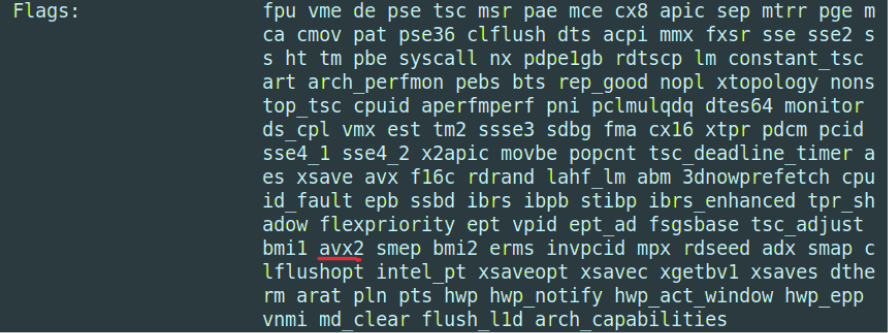

شاید در درس‌هایی مثل «ساختار کامپیوتر» یا «معماری کامپیوتر» با ISA آشنا شده باشید یا حتی نمونه‌ای ساده از آن را پیاده‌سازی کرده باشید. ISA ها استاندارد‌هایی هستند و بیانگر مجموعۀ دستورالعمل‌هایی هستند که یک پردازنده می‌تواند انجام دهد. اما معماران کامپیوتر چگونه ISA ها را طراحی می‌کنند و یا تکامل می‌دهند؟ نخستین ISA ها چگونه شکل گرفتند؟ و امروزه دستگاه‌های دیجیتال پیرامون ما بر پایۀ کدام‌یک از آن‌ها ساخته می‌شوند؟ در این متن می‌کوشیم به این پرسش‌ها پاسخ دهیم.

سفرمان را به دهه‌های ۶۰ و ۷۰ میلادی آغاز می‌کنیم. زمانی که غول‌هایی مانند IBM بازار کامپیوتر را در دست داشتند. آن روزها اکوسیستم نرم‌افزار مانند امروز بالغ نشده بود و هر برنامه معمولاً برای سخت‌افزار مشخصی نوشته می‌شد؛ بنابراین تعویض سیستم اغلب به معنای بازنویسی برنامه‌ها بود.

در سال ۱۹۶۴، IBM با معرفی System/360 بازی را عوض کرد: یک معماری واحد برای خانواده‌ای از سیستم‌ها؛ یعنی مشتریان می‌توانستند نرم‌افزارهایشان را بدون بازنویسی روی مدل‌های مختلف اجرا کنند. چند سال بعد، Intel 4004 نخستین ریزپردازندۀ ۴-بیتی را روی یک تراشه عرضه کرد و در ادامه خانوادۀ x86 (یا 8086 در سال ۱۹۷۸) به معماری غالب رایانه‌های شخصی بدل شد.

وجود استانداردهایی مانند ISA سبب شد توسعه‌دهندگان انواع نرم‌افزار‌ها از سیستم‌عامل گرفته تا برنامه‌های تحت وب، بدون آن‌که درگیر جزئیات پیاده‌سازی هر پردازنده شوند، تنها با تکیه بر مجموعۀ دستورالعمل‌های پشتیبانی‌شده، نرم‌افزار بنویسند.

برای طراحی یک ISA باید هم‌زمان به نیازهای سخت‌افزاری و نرم‌افزاری توجه کرد. معماری موفق باید روی طیف وسیعی از پردازنده‌ها با اهداف گوناگون (از مصرف کم تا کارایی بالا) قابل‌پیاده‌سازی باشد و در عین حال، واسط مناسبی برای کامپایلرها و مترجم‌ها فراهم کند تا برنامه‌ها را به دستورهای مناسب تبدیل کنند. همین نیازهای متنوع —و گاه متضاد— باعث شده‌است رویکردهای مختلفی در طراحی ISA شکل بگیرند.

دهۀ ۸۰ میلادی آغاز یکی از جدل‌های ماندگار بود: <Tooltip tip="Reduced Instruction Set Computer">RISC</Tooltip> در برابر <Tooltip tip="Complex Instruction Set Computer">CISC</Tooltip>. گروهی از مهندسان IBM نشان دادند بسیاری از برنامه‌ها عمدتاً از تعداد محدودی دستور ساده استفاده می‌کنند؛ پس با ساده‌سازی ISA و بهینه کردن مسیر اجرا، می‌توان به کارایی بالاتری رسید.

این نگاه به شکل‌گیری خانواده‌هایی چون MIPS -دستورالعمل استفاده‌شده در کنسول بازی Playstation 2- انجامید و بعدها ARM با تکیه بر همین سادگی و بهره‌وری انرژی، انتخاب غالب تلفن‌های همراه شد. RISC-V از دیگر مجموعۀ دستورالعمل‌های رایج این دسته است که به‌صورت متن‌باز عرضه می‌شود. این بدان معناست که می‌توان پردازنده‌های مبتنی بر این ISA را بدون خرید مجوز، طراحی و تولید کرد.

ISA ها نیز با توجه به نیازهای جدید برنامه‌ها تکامل می‌یابند. این تکامل معمولاً به‌صورت افزونه‌هایی روی ISA پایه ارائه می‌شود. نمونۀ شاخص آن، پردازش برداری یا <Tooltip tip="Single Instruction, Multiple Data">SIMD</Tooltip> است: «یک دستور برای چندین داده»؛ رویکردی که برای شتاب دادن به کارهای گرافیکی، پردازش سیگنال، رمزنگاری و یادگیری ماشین به‌کار می‌رود.

در دنیای x86، این نقش را خانوادۀ SSE و سپس AVX/AVX2/AVX-512 بر عهده دارند (روی پردازنده‌های اینتل و AMD). در ARM ابتدا NEON معرفی شد و در نسل‌های جدیدتر، SVE/SVE2 با طول بردار انعطاف‌پذیر، همین مسیر را ادامه داده‌اند. در RISC-V نیز افزونۀ V قابلیت‌های برداری را به‌صورت ماژولار و با طول بردار پویا ارائه می‌کند. کامپایلر‌ها با بررسی پشتیبانی از انواع افزونه‌ها، از دستورات این افزونه‌ها برای افزایش سرعت اجرای برنامه استفاده می‌کنند. شما می‌توانید وجود این افزونه را با دستور `lscpu` و مشاهدۀ قسمت `flags` بررسی کنید.

    

انتخاب ISA برای طراحی یک پردازنده، تابع مجموعه‌ای از ملاحظات فنی و تجاری است. بلوغ و وسعت اکوسیستم نرم‌افزاری و سازگاری با برنامه‌های موجود، مدل مجوز و هزینۀ بهره‌برداری (یا متن‌باز بودن) استاندارد، پیچیدگی و هزینۀ پیاده‌سازی و اهدافی نظیر کارایی/مصرف توان و عوامل اجرایی مانند زمان عرضه، برخی از عوامل مؤثر در این زمینه هستند.

به‌طور مثال، در سال‌های اخیر، سرور‌های مبتنی بر RISC-V به‌دلیل متن‌باز بودن و وجود افزونه‌ها با دستوراتی برای <Tooltip tip="Cryptography">رمزنگاری</Tooltip> و محاسبات برداری مورد استقبال قرار گرفته‌اند.

سفر ISA از سیستم‌های یکپارچه و انحصاری تا دنیای متنوع و رقابتی امروز، داستان تلاشی بی‌وقفه برای یافتن بهترین زبان مشترک میان نرم‌افزار و سخت‌افزار است.

روایتی که همچنان ادامه دارد و نشان‌گر تحول دنیای کامپیوترهاست.
