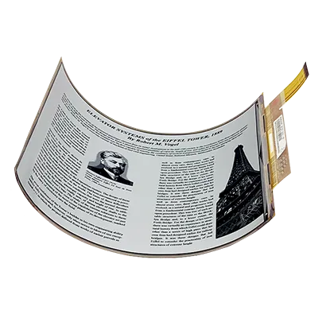
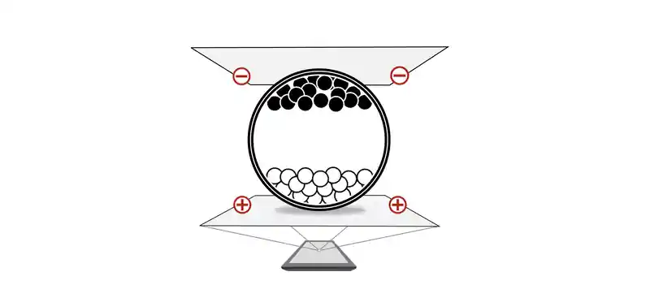

فرض کنید در حال مطالعهٔ یک سند محرمانه یا پیش‌نویس مقاله‌ای هستید که هنوز نباید کسی از محتوای آن باخبر شود. ناگهان درِ اتاق باز می‌شود و فردی وارد می‌گردد. شتاب‌زده دکمهٔ خاموش را فشار می‌دهید؛ دستگاه خاموش می‌شود، اما متن، با خونسردی تمام، همچنان روی صفحه باقی مانده است.

اگر با کتاب‌خوان‌های الکترونیکی کار کرده باشید، این صحنه برایتان آشناست. حتی اگر تاکنون کتاب‌خوان در دست نگرفته باشید، احتمالاً نسخهٔ کوچک‌تر این فناوری را در فروشگاه‌های زنجیره‌ای کشورهای دیگر دیده‌اید: همان برچسب‌های دیجیتال قیمت (ESL) روی لبهٔ قفسه‌ها که آن‌قدر واضح و بی‌نورند که مخاطب شک می‌کند کاغذ چاپی هستند یا نمایشگر دیجیتال (هرچند جای سؤال است که چرا هنوز در فروشگاه‌های ایران سراغ آن‌ها نرفته‌اند؟).

صفحهٔ جوهر الکترونیکی (E Ink) پس از قطع کامل جریان برق نیز تصویر را همچون یک برگهٔ چاپ‌شده نگه می‌دارد. همین ویژگی، پرسشی جدی را در ذهن هر دانشجو و مهندس شکل می‌دهد: چه تفاوتی میان ساختار این نمایشگر با صفحهٔ گوشی و لپ‌تاپ وجود دارد که هم چنین رفتار عجیبی از خود نشان می‌دهد، هم کندتر است، هم هنگام تعویض صفحه چشمک می‌زند و هم در کمال تعجب، برای خرید یک نسخهٔ سیاه‌وسفید آن باید هزینه‌ای همسنگ یک تبلت تمام‌رنگی پرداخت کرد؟

## یک تصویر، میلیون‌ها ذرهٔ سرگردان
برخلاف نمایشگرهای LCD یا OLED که در آن‌ها هر پیکسل مانند یک منبع نوری کوچک به سمت چشمان کاربر نور می‌تاباند، نمایشگر جوهر الکترونیکی مجموعه‌ای میکروسکوپی از ذرات فیزیکی است. در این صفحات، میلیون‌ها کپسول بسیار ریز (یا حفره‌های میکروکاپ) میان دو لایهٔ الکترود قرار گرفته‌اند که درون آن‌ها مایعی شفاف و ذرات رنگی باردار شناورند؛ در مدل‌های متداول، ذرات سفید دارای بار مثبت و ذرات سیاه دارای بار منفی هستند.

هنگامی که به الکترود زیرین ولتاژ اعمال می‌شود، ذرات همنام دفع و ذرات ناهمنام جذب می‌شوند؛ در نتیجه، ذرات سفید بالا می‌آیند یا ذرات سیاه جای آن‌ها را می‌گیرند تا حروف شکل بگیرند. آنچه چشم انسان می‌بیند، بازتاب نور محیط از روی همین ذرات واقعی است. البته بسیاری از کتاب‌خوان‌ها برای مطالعه در تاریکی به «چراغ جلویی» (Front Light) مجهز هستند، اما تفاوت کلیدی در زاویهٔ تابش است: این نور نه از پشت صفحه به مردمک چشم، بلکه از لبه‌ها به سطح صفحه می‌تابد و بازتاب ملایم آن به چشم می‌رسد [۱، ۲].

«جریان برق، آرایش ذرات را تغییر می‌دهد؛ اما ذرات، تصویر را بدون نیاز به برق نگه می‌دارند.» (مبنای فنی طرح: منبع ۱)

شاهکار ماجرا اینجاست: این فناوری **دوپایدار (Bistable)** است؛ یعنی برای تکان‌دادن ذرات به برق نیاز دارید، اما وقتی هر ذره سر جایش نشست، در همان مایع غلیظ معلق می‌ماند و حتی اگر سیم باتری دستگاه را با قیچی ببُرید، متن روی صفحه دست‌نخورده باقی می‌ماند! [۲]

همین ویژگی اعجاب‌انگیز است که این روزها سر از **اتیکت‌های الکترونیکی قیمت (ESL)** در فروشگاه‌های بزرگ کشورهای دیگر درآورده است (که البته جای سؤال است چرا هنوز در فروشگاه‌های ایران سراغش نرفته‌اند؟). در این هایپرمارکت‌ها، قیمت قفسه‌ها روی نمایشگرهای کوچکی با کنتراست فوق‌العاده بالا ثبت شده است که از نزدیک شبیه کاغذ چاپی به نظر می‌رسند. این‌ها همان پنل‌های جوهر الکترونیکی‌اند؛ نمایشگرهایی که تنها با یک باتری ساعتی کوچک، ۵ تا ۷ سال روشن می‌مانند! مدیر فروشگاه با فشردن یک کلید در نرم‌افزار، قیمت ۱۰ هزار قلم کالا را هم‌زمان عوض می‌کند؛ ذرات تکان می‌خورند، قیمت جدید نقش می‌بندد و تا تخفیف بعدی، هیچ میلی‌آمپر برقی مصرف نمی‌شود.

همین جابه‌جایی فیزیکی، علت کندی و چشمک‌زدن صفحه نیز هست. برخلاف پیکسل‌های کریستال مایع که در کسری از میلی‌ثانیه تغییر وضعیت می‌دهند، در اینجا ذرات جامد باید مسافت مشخصی را درون یک سیال غلیظ طی کنند. برای آنکه ذرات در میانهٔ راه متوقف نشوند و سایه‌های خاکستری ناخواسته نسازند، تراشهٔ کنترل‌کننده هنگام ورق‌زدن صرفاً یک پالس ساده ارسال نمی‌کند؛ بلکه دنباله‌ای محاسبه‌شده از ولتاژهای متناوب، موسوم به *موج‌فرم به‌روزرسانی*، را اعمال می‌کند. آن چشمک سیاه‌وسفید هنگام ورق‌زدن، ناشی از درگیر شدن پردازنده نیست؛ بلکه فرایند بازنشانی آرایش ذرات برای جلوگیری از باقی‌ماندن رد تصویر قبلی یا همان **تصویر شبح‌وار (Ghosting)** است [۲، ۱۱].

البته سرعت این فناوری ثابت نمانده است؛ برای نمونه، در نسل‌های رنگی جدیدتر مانند Gallery 3 که از چهار نوع ذرهٔ رنگی استفاده می‌کنند، زمان به‌روزرسانی سیاه‌وسفید به حدود ۳۵۰ میلی‌ثانیه رسیده است. با این حال، مصالحهٔ مهندسی همچنان پابرجاست: نمایشگری که برای متن ایستا کم‌نظیر است، گزینهٔ مناسبی برای پخش ویدیو و تصاویر متحرک نخواهد بود [۳].

## معمای قیمت؛ مگر پتنت‌ها در سال‌های ۲۰۱۷ و ۲۰۱۹ منقضی نشدند؟
وقتی یک دفتر دیجیتال یا کتاب‌خوان E Ink را کنار یک تبلت معمولی قرار می‌دهیم، نخستین پرسش به برچسب قیمت آن بازمی‌گردد: چرا دستگاهی با پردازندهٔ ساده‌تر و صفحهٔ سیاه‌وسفید، هم‌قیمت یا حتی گران‌تر از یک تبلت چندمنظوره است؟

در سال‌های ۲۰۱۷ و ۲۰۱۹، موجی از خوش‌بینی میان علاقه‌مندان سخت‌افزار شکل گرفت. علت آن بود که پتنتِ پایهٔ «نمایشگر <Tooltip tip="حرکت ذرات">الکتروفورتیک</Tooltip> میکروکپسولی» (ثبت‌شده توسط پژوهشگران دانشگاه MIT در سال ۱۹۹۷ با شمارهٔ US5961804A) و یکی از پتنت‌های کلیدی شرکت E Ink (شمارهٔ US6172798B1) به پایان دورهٔ اعتبار قانونی خود رسیدند. بسیاری انتظار داشتند با انقضای این اسناد، انحصار بازار بشکند، کارخانه‌های رقیب وارد میدان شوند و قیمت‌ها به شدت کاهش یابد. اما چرا چنین اتفاقی رخ نداد؟

### نخست؛ شبکه‌ای از ۱۹۰۰ پتنت فعال

آنچه در سال‌های ۲۰۱۷ و ۲۰۱۹ منقضی شد، تنها دو سند کلیدی بود، نه تمام دارایی فکری این صنعت. طبق گزارش رسمی شرکت E Ink، این مجموعه تا پایان ژوئیهٔ ۲۰۲۶ حدود **۱۹۰۰ پتنت صادرشده و معتبر** در آمریکا، تایوان و چین در اختیار داشته است. این مجموعهٔ حقوقی از فرمول شیمیایی سیال و پوشش ضدبازتاب گرفته تا مدارهای راه‌انداز، الگوریتم‌های موج‌فرم و ساختار پنل‌های رنگی را در بر می‌گیرد [۶]. انقضای یک پتنت پایه، به معنای گشوده‌شدن دروازهٔ خط تولید به روی رقبا نیست.

### دوم؛ تفاوت فرمول ثبت‌شده با خط تولید

صفحهٔ کتاب‌خوان یک ورق جوهر تنها نیست؛ بلکه ساختاری چندلایه متشکل از فیلم جوهر، صفحهٔ ترانزیستورهای لایه‌نازک (TFT)، تراشهٔ راه‌انداز، لایهٔ لمسی (معمولاً مبتنی بر فناوری الکترومغناطیسی برای قلم) و لایهٔ هدایت نور است [۴]. چالش اصلی در اینجا، **نرخ بازده تولید (Yield Rate)** در ابعاد بزرگ است. به‌محض آنکه از تولید برچسب قیمت ۲ اینچی به سمت تولید پنل‌های ۱۰ یا ۱۳ اینچی (مناسب برای خواندن مقالات علمی و فایل‌های PDF) حرکت می‌کنیم، کوچک‌ترین ناهماهنگی در ضخامت لایهٔ کپسول‌ها باعث می‌شود کل پنل از رده خارج شود. شرکت E Ink در گزارش‌های سرمایه‌گذاران خود صراحتاً به چالش بازده تولید در گسترش پنل‌های بزرگ‌تر اشاره کرده است [۵].

علاوه بر این، مقیاس بازار نقش تعیین‌کننده‌ای دارد. سالانه صدها میلیون پنل LCD و OLED برای تلفن‌های همراه و تلویزیون‌ها تولید می‌شود که هزینهٔ سرمایه‌گذاری اولیه را سرشکن می‌کند؛ اما بازار کاغذ الکترونیکی بازاری تخصصی با تیراژ محدودتر است که در آن اکثر برندهای شناخته‌شده (از Kindle و Kobo گرفته تا Boox و reMarkable) تولیدکنندهٔ لایهٔ نمایشگر نیستند، بلکه خریدار یک زنجیرهٔ تأمین متمرکز به شمار می‌روند.

## وقتی قلم وارد می‌شود؛ چرا نوشتن روی شیشه حس کاغذ را ندارد؟
برای یک دانشجو یا پژوهشگر، کاربری این دستگاه‌ها تنها به روخوانی محدود نمی‌شود؛ حاشیه‌نویسی روی مقالات، حل روابط ریاضی و ترسیم نمودار بخش جدایی‌ناپذیر مطالعه است. اما چرا بسیاری از کاربران پس از تهیهٔ تبلت‌های معمولی و قلم‌های دیجیتال، دوباره به دفترهای کاغذی بازمی‌گردند؟

پاسخ در مهندسی سطح و علوم اعصاب نهفته است. حرکت نوک قلم پلاستیکی روی شیشهٔ صیقلی تبلت، اصطکاکی نزدیک به صفر دارد. افزون بر این، ضخامت شیشهٔ محافظ باعث ایجاد فاصلهٔ دیداری (Parallax) میان نوک قلم و خط دیجیتال می‌شود و عضلات دست برای کنترل لغزش قلم، نیازمند انقباض بیشتری هستند [۱۲].

پژوهش‌های علوم اعصاب نیز نشان می‌دهند که بازخورد لمسی هنگام نوشتن، با فرایند ثبت اطلاعات در مغز ارتباط دارد. در یک مطالعهٔ تصویربرداری مغزی (fMRI) توسط *اومه‌جیما و همکاران*، مشخص شد افرادی که مطالب را روی کاغذ ثبت می‌کنند، نسبت به گروهی که با قلم روی تبلت یا تلفن همراه کار می‌کنند، هم سرعت بالاتری دارند و هم هنگام یادآوری اطلاعات، فعالیت قوی‌تری در ناحیهٔ هیپوکامپ مغز (مرتبط با حافظه و کدگذاری فضایی) نشان می‌دهند [۱۳]. اگرچه در برخی تکالیف آزمایشگاهیِ ساده‌تر، تفاوت نمرهٔ یادگیری میان قلم جوهری و قلم دیجیتال معنادار گزارش نشده است [۱۴]، اما شواهد نشان می‌دهد **اصطکاک سطح و ثبات فضایی صفحه** تجربهٔ شناختی متفاوتی رقم می‌زند.

مزیت رقابتی تبلت‌های یادداشت‌برداری E Ink دقیقاً در همین نقطه تعریف می‌شود: با حذف شیشهٔ ضخیم و استفاده از پوشش‌های بافت‌دار روی صفحه در کنار نوک قلم‌های نمدی، مقاومت مکانیکی کاغذ را زیر دست کاربر شبیه‌سازی می‌کنند و هم‌زمان امکان ذخیره‌سازی و جست‌وجوی دیجیتال را فراهم می‌آورند [۱۲].

## خریدن یک «محدودیت»؛ از خستگی چشم تا تمرکز در افراد دارای ADHD
مهم‌ترین پرسش برای دانشجویی که روزانه ساعت‌ها با متون تخصصی سروکار دارد این است: **آیا این نمایشگر واقعاً تمرکز را بهبود می‌بخشد؟**

بخش نخست پاسخ به فیزیولوژی بینایی مربوط است. مطالعات مقایسه‌ای میان نمایشگر LCD، صفحهٔ E Ink و کتاب کاغذی نشان می‌دهند که اگرچه از نظر سرعت خواندن، یک پنل E Ink باکیفیت عملکردی مشابه LCD دارد [۱۰]، اما در معیار **خستگی دیداری (Visual Fatigue)** تفاوت آشکاری دیده می‌شود. مطالعهٔ طولانی‌مدت روی LCD به‌دلیل تابش مستقیم نور پس‌زمینه، نرخ پلک‌زدن را کاهش داده و خستگی چشمی بیشتری نسبت به کاغذ و E Ink ایجاد می‌کند، در حالی که رفتار نوری E Ink بسیار نزدیک به کاغذ چاپی است [۹].

بخش دوم پاسخ، به **معماری حواس‌پرتی** و چالش نقص توجه و بیش‌فعالی (**ADHD**) بازمی‌گردد. پژوهش‌های شناختی روی دانشجویان و نوجوانان دارای ADHD نشان داده‌اند که مطالعهٔ متون روی صفحات دیجیتال متداول، در مقایسه با کاغذ، می‌تواند با افت درک مطلب، دشواری در حفظ توجه پایدار (Sustained Attention) و خطا در مدیریت زمان همراه باشد [۷، ۸].

محیط دیجیتال معمولی از دو مسیر تمرکز را تهدید می‌کند:

1. **پیمایش عمودی (Scroll) در برابر ورق‌زدن:** مغز انسان هنگام مطالعه، یک «نقشهٔ فضایی» از موقعیت جملات در چهارچوب ثابتی از صفحه می‌سازد. پیمایش پیوسته روی تبلت و رایانه، این لنگرگاه تصویری را برهم می‌زند و بار اضافی بر حافظهٔ فعال تحمیل می‌کند.

2. **بار شناختیِ مقاومت در برابر اعلان‌ها:** روی دستگاهی که یک کلیک با شبکه‌های اجتماعی و پیام‌رسان‌ها فاصله دارد، بخشی از ظرفیت اجرایی مغز صرفِ مقاومت در برابر وسوسهٔ خروج از متن می‌شود.

نمایشگر جوهر الکترونیکی درمان پزشکی برای اختلال توجه نیست؛ اما با **تبدیل محدودیت سخت‌افزاری به یک سپر محیطی**، به کمک تمرکز می‌آید. در کتاب‌خوان، متن نه با پیمایش عمودی، بلکه صفحه به صفحه ورق می‌خورد و ثبات فضایی حفظ می‌شود. از سوی دیگر، صفحهٔ سیاه‌وسفید با نرخ نوسازی کند، مرور شبکه‌های اجتماعی و تماشای ویدیو را چنان بی‌جاذبه می‌کند که چرخهٔ پاداش فوریِ این برنامه‌ها عملاً از کار می‌افتد. در واقع، خریدار این دستگاه بخش زیادی از هزینهٔ خود را می‌پردازد تا **امکان حواس‌پرتی را از سخت‌افزار خود حذف کند**.

کاغذ الکترونیکی مجموعه‌ای از مصالحه‌های مهندسی است: مصرف انرژی ناچیز برای *نگه‌داشتن* تصویر در برابر زمان بیشتر برای *تغییر* آن؛ و آرامش چشم و تمرکز عمیق در برابر چشم‌پوشی از رنگ‌های درخشان و انیمیشن‌های سریع. این فناوری قرار نیست جایگزین تلفن همراه یا لپ‌تاپ شود؛ بلکه در میان انبوه نمایشگرهایی که ثانیه‌به‌ثانیه برای ربودن توجه ما نور می‌تابانند، آرام در کناری می‌ایستد و می‌پرسد: **اگر قرار باشد یک صفحه هیچ تلاشی برای فریفتن مغز نکند، دوست دارید روی آن چه چیزی باقی بماند؟**

## پانویس‌ها و منابع

[۱] E Ink Corporation, *How E Ink Electronic Paper Works & Front Light Technology* ([eink.com/tech](https://www.eink.com/tech)).

[۲] E Ink Corporation, *Bistability and Power Consumption Benefits* ([eink.com/tech/detail/Benefits](https://www.eink.com/tech/detail/Benefits)).

[۳] E Ink Corporation, *E Ink Launches E Ink Gallery 3 Color ePaper for Sustainable Digital Reading* ([eink.com/news](https://www.eink.com/news/detail/E%20Ink_Launches_E%20Ink_Gallery_3_Color_ePaper_for_Sustainable_Digital_Reading)) (۳۵۰ میلی‌ثانیه در حالت سیاه‌وسفید).

[۴] E Ink ESG & Supply Chain Report, *Display Module Components and Manufacturing Layers* (2024).

[۵] E Ink Investor Relations, *Operational Scaling and Yield Challenges in Large-Format Panels*.

[۶] E Ink Investor Relations, *Intellectual Property Management* ([eink.com/investor/governance](https://www.eink.com/investor/governance?bookmark=ip)) (آمار حدود ۱۹۰۰ پتنت صادرشده تا پایان ژوئیهٔ ۲۰۲۶، به همراه سوابق پتنت‌های US5961804A و US6172798B1).

[۷] Ben-Yehudah, G., & Brann, A. (2019). *Pay attention to digital text: The impact of the media on text comprehension and self-monitoring in higher-education students with ADHD*. Research in Developmental Disabilities ([PMID: 30981195](https://pubmed.ncbi.nlm.nih.gov/30981195/)).

[۸] Stern, P., & Shalev, L. (2013). *The role of sustained attention and display medium in reading comprehension among adolescents with ADHD and without it*. Research in Developmental Disabilities ([PMID: 23023301](https://pubmed.ncbi.nlm.nih.gov/23023301/)).

[۹] Benedetto, S., et al. (2013). *E-readers and visual fatigue*. PLOS ONE ([PMID: 24386252](https://pubmed.ncbi.nlm.nih.gov/24386252/)).

[۱۰] Siegenthaler, E., et al. (2012). *Reading on LCD vs e-Ink displays: effects on fatigue and visual strain*. Ophthalmic & Physiological Optics ([PMID: 22762257](https://pubmed.ncbi.nlm.nih.gov/22762257/)).

[۱۱] Waveshare Electronics, *E-Paper Module Manual: Partial Refresh and Ghosting Phenomenon*.

[۱۲] Annett, M., Anderson, F., Bischof, W. F., & Gupta, A. (2014). *The Pen Is Mightier: Understanding Stylus Behaviour While Inking on Tablets* (Graphics Interface; [PDF](https://webdocs.cs.ualberta.ca/~wfb/publications/C-2014-GI-Pen.pdf)) & E Ink Digital Paper Device Specifications.

[۱۳] Umejima, K., et al. (2021). *Paper Notebooks vs. Mobile Devices: Brain Activation Differences During Memory Retrieval*. Frontiers in Behavioral Neuroscience ([DOI](https://www.frontiersin.org/journals/behavioral-neuroscience/articles/10.3389/fnbeh.2021.634158/full)).

[۱۴] Osugi, K., et al. (2019). *Differences in Brain Activity After Learning With the Use of a Digital Pen vs. an Ink Pen—An Electroencephalography Study*. Frontiers in Human Neuroscience ([DOI](https://doi.org/10.3389/fnhum.2019.00275)).

