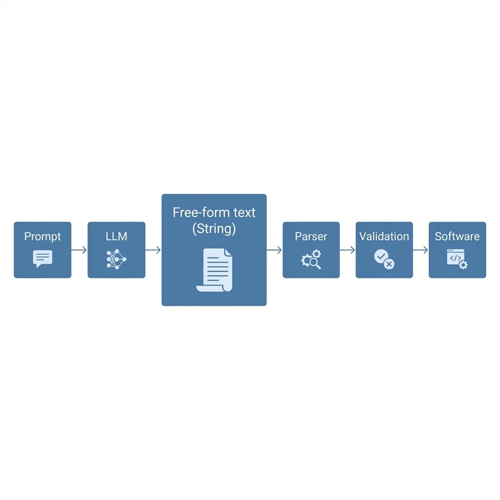
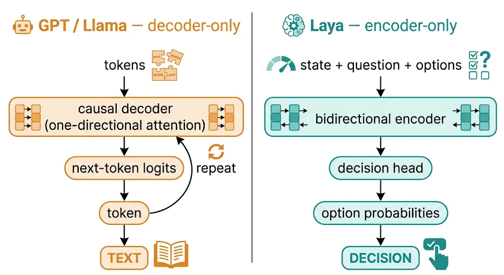
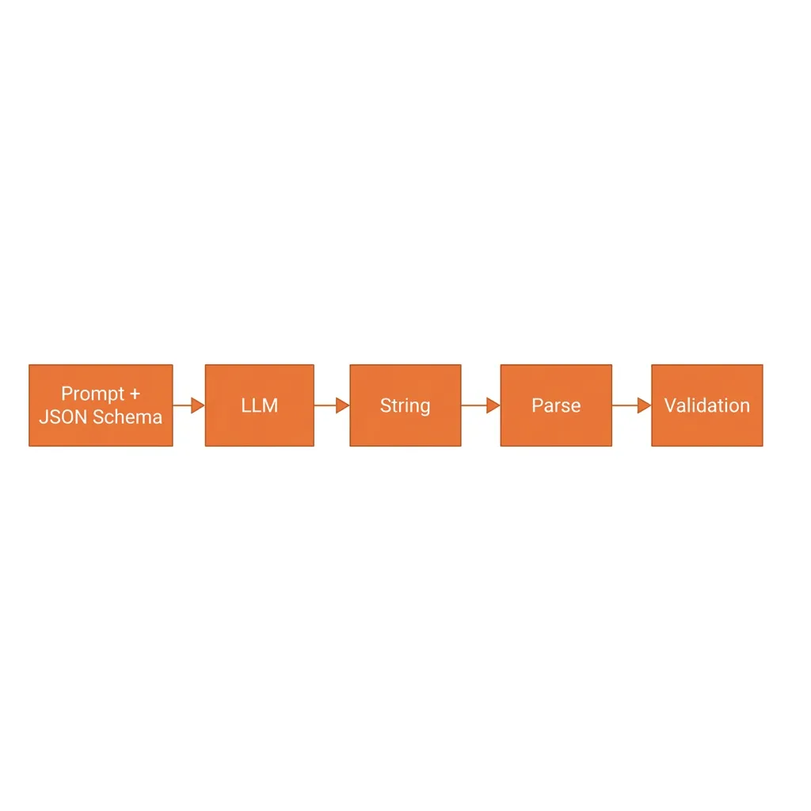
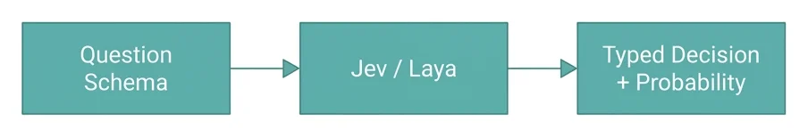
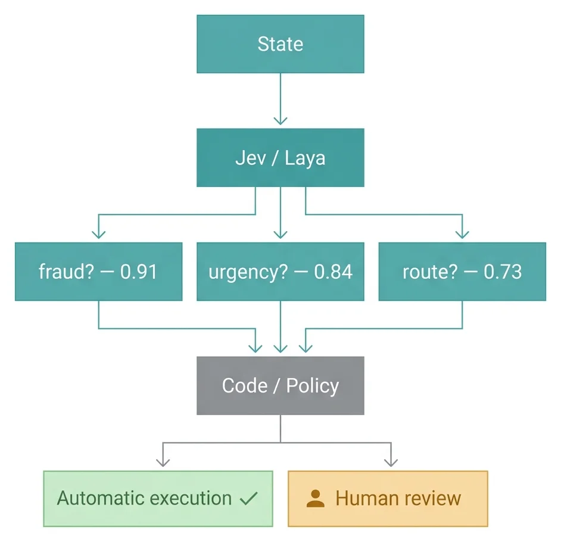
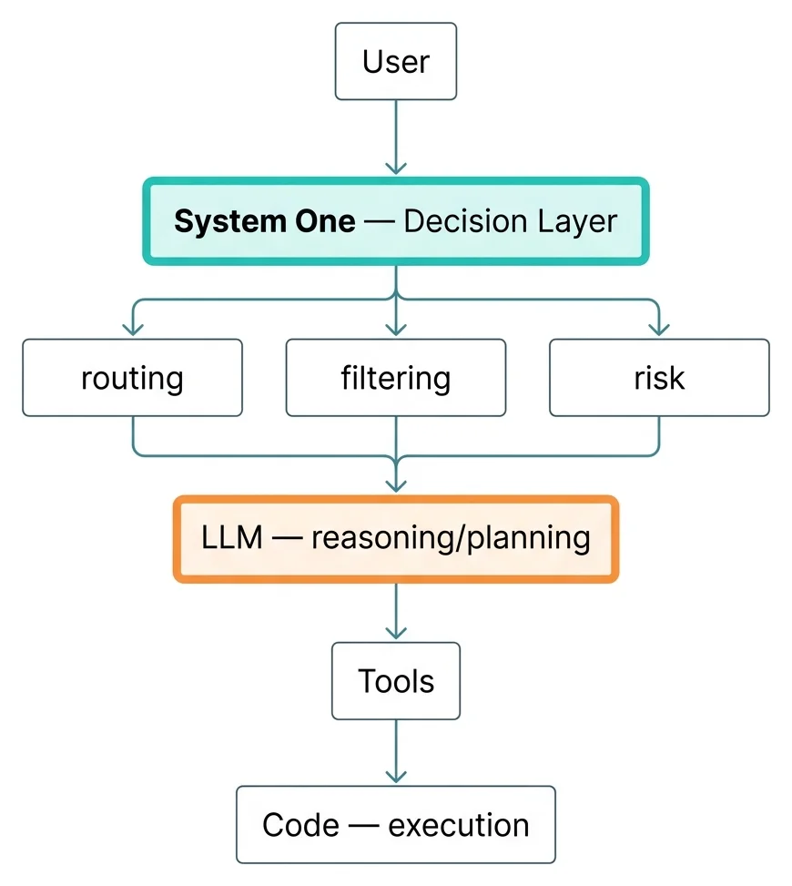

مدل‌های زبانی بزرگ در چند سال گذشته یک کار را بهتر از هر زمان دیگری انجام داده‌اند: حرف زدن. مقاله می‌نویسند، کد تولید می‌کنند، به ایمیل جواب می‌دهند، استدلال می‌کنند. اما یک سؤال مهندسی ساده معمولاً زیر همهٔ این هیجان گم می‌شود: اگر قرار نیست خروجی را انسانی بخواند، اصلاً چرا مدل باید یک رشتهٔ متنی تولید کند؟

یک تیکت پشتیبانی باید به کدام تیم برود؟ یک تراکنش fraud است یا نه؟ یک مقاله به چه هشتگ‌هایی تعلق دارد؟ در همهٔ این‌ها، نرم‌افزار به یک پاراگراف قانع‌کننده نیاز ندارد؛ فقط یک تصمیم می‌خواهد، بله یا خیر! همین. نه توضیح، نه مقدمه، نه «به نظر می‌رسد که...».

از دل همین مشاهده، شرکت TypeSafe ایدهٔ System One Models را مطرح کرده و اولین محصول این خانواده، مدلی به نام Jev، در ۱۵ سپتامبر ۲۰۲۶ به صورت early access روی <Tooltip tip="پلتفرم مدل‌ها"><span>OpenRouter</span></Tooltip> عرضه شده است. ادعای اصلی TypeSafe این است: برای بخش بزرگی از کارهایی که امروز با LLM انجام می‌دهیم، تولید متن لازم نیست و یک تصمیم ساختاریافته و <Tooltip tip="Calibrated"><span>کالیبره‌شده</span></Tooltip> کافی است. از منظر مهندسی، این را می‌توان تغییری در رابط مدل دانست؛ به این معنا که مدل از تولید مستقیم متن، به تصمیم‌گیری احتمالی بر مبنای وضعیت موجود حرکت می‌کند. همین تغییر در رابط، محور اصلی چیزی است که در ادامه بررسی می‌کنیم.

## چرا هوش مصنوعی باید حرف بزند؟

مدل‌های زبانی برای تولید دنبالهٔ توکن ساخته شده‌اند: ورودی هر چیزی می‌تواند باشد، خروجی هم از یک کلمه تا هزاران خط کد. همین آزادی، بزرگ‌ترین نقطهٔ قوت آن‌هاست؛ اما وقتی مسئله فقط یک طبقه‌بندی یا یک تصمیم دوتایی است، همین آزادی به یک زنجیرهٔ اضافه تبدیل می‌شود:



مدل ممکن است حتی خروجی را به شکل JSON هم بدهد، اما همچنان یک language model است که یک رشته تولید کرده؛ نرم‌افزار باید آن رشته را parse کند، اعتبارسنجی کند و امیدوار باشد که مدل دقیقاً همان schema‌ای را رعایت کرده که انتظارش می‌رفت.

TypeSafe می‌گوید این زنجیره را می‌شود از پایه بازطراحی کرد: اگر مسئله یک تصمیم است، چرا مدلی نسازیم که از اول برای تولید decision طراحی شده، نه برای تولید string؟

## System One: مدلی که تصمیم تولید می‌کند، نه متن

نام System One Models از تمایز معروف دنیل کانمان میان System 1 و System 2 در کتاب Thinking, Fast and Slow الهام گرفته شده است. کانمان در این کتاب ذهن انسان را به دو شیوهٔ تفکر تقسیم می‌کند: System 1 سریع، خودکار و شهودی است و تقریباً بدون تلاش آگاهانه کار می‌کند؛ مثلاً وقتی چهرهٔ عصبانی کسی را تشخیص می‌دهید یا حاصل ۲+۲ را می‌گویید. System 2 کند، آگاهانه و تحلیلی است و برای کارهایی که تمرکز می‌خواهند فعال می‌شود؛ مثلاً حل یک مسئلهٔ ریاضی پیچیده یا مقایسهٔ دقیق دو گزینه. TypeSafe همین ایده را برای ماشین بازتعریف کرده: مدلی سریع، ارزان و بدون استدلال زنجیره‌ای، برای تصمیم‌های محدود و پرتکرار داخل نرم‌افزار. به این خانواده از مدل‌ها دو چیز می‌دهید: یک state (محتوایی که باید درباره‌اش تصمیم گرفته شود؛ مثل متن یک تیکت، یک مقاله یا یک تراکنش) و مجموعه‌ای از questions که در کد خودتان تعریف می‌کنید. سه primitive این پرسش‌ها را می‌سازند:

1. choice از میان چند گزینهٔ از پیش تعریف‌شده انتخاب می‌کند و توزیع احتمال روی همهٔ گزینه‌ها را برمی‌گرداند
2. score روی یک مقیاس ترتیبی (حداکثر ۱۰ سطح) امتیاز می‌دهد و میانگین وزنی سطح‌ها را برمی‌گرداند
3. noul (مخفف Bernoulli) به یک گزارهٔ بله/خیر، با عددی بین ۰ و ۱ جواب می‌دهد و احتمال درست بودن آن گزاره را برمی‌گرداند.

نکتهٔ مهم اینجاست که شما دیگر از مدل نمی‌پرسید «نظرت درباره این متن چیست؟»؛ می‌پرسید: «برای این سؤال مشخص، احتمال هر گزینه چقدر است؟» فضای پاسخ از قبل بسته است؛ مدل فقط باید آن را با احتمال پر کند.

## دو پیاده‌سازی، دو سطح شفافیت: Jev و Laya

ایدهٔ System One محصول یک شرکت نیست. TypeSafe در ۱۵ سپتامبر ۲۰۲۶ نسخهٔ early access مدل Jev را منتشر کرد؛ فقط سه روز بعد، در ۱۸ سپتامبر، Convai Innovations مدل **Laya** را به صورت <Tooltip tip="وزن‌باز"><span>open-weight</span></Tooltip> منتشر کرد. این فاصلهٔ کوتاه به این معنا نیست که Laya واکنشی به Jev بوده است: طبق توضیح نویسندهٔ Laya، کار روی این ایده از مارس ۲۰۲۵ شروع شده و در دو مقالهٔ arXiv در سال ۲۰۲۵ آمده بود؛ یعنی بسیار پیش از معرفی Jev. هم‌زمانی این دو انتشار بیشتر نشان می‌دهد System One یک محصول تک‌شرکتی نیست و چند تیم مستقل از هم به سمت همین رابط، یعنی تصمیم typed و احتمالاتی، نه متن، حرکت کرده‌اند. TypeSafe با Jev یک سرویس managed و بسته ارائه کرده؛ اما Laya همان ایده را به صورت open-weight پیاده کرده و مهم‌تر از آن، معماری‌اش را کامل مستند کرده است. همین تفاوت شفافیت باعث می‌شود بهترین راه برای فهم چگونگی کار این مدل‌ها، نگاه‌کردن به Laya باشد، نه Jev.

## معماری Laya: یک encoder، نه یک decoder

طبق مستندات Laya، backbone نسخهٔ انگلیسی این مدل ModernBERT-large با حدود ۳۹۵ میلیون <Tooltip tip="Parameter"><span>پارامتر</span></Tooltip> است و یک Transformer دوطرفه (bidirectional encoder) از همان خانوادهٔ BERT محسوب می‌شود، نه از خانوادهٔ GPT. روی این backbone یک decision head اختصاصی نشسته: دو لایهٔ Transformer اضافه، یک «option-marker scorer» و یک «act/escalate head»، که مجموعاً پارامترهای مدل را به حدود ۴۲۱ میلیون می‌رسانند. مکانیزم کار به این شکل است: هر گزینهٔ سؤال (مثلاً هر یک از "billing"، "technical"، "account") در ورودی مدل یک نشانهٔ مخصوص به خودش می‌گیرد. مدل روی کل دنباله (state + question + options) یک بار عبور می‌کند، representation هر marker را می‌گیرد، decision head روی آن یک امتیاز می‌سازد، و در پایان یک <Tooltip tip="تابع احتمال"><span>softmax</span></Tooltip> روی امتیاز همهٔ گزینه‌های همان سؤال زده می‌شود. این معماری را بهتر می‌شود با کنار هم گذاشتنش با یک LLM مولد فهمید:



اینجا یک سوءبرداشت رایج باید روشن شود: آیا Laya فقط یک LLM است که decoder‌اش را برداشته‌اند؟ نه دقیقاً. حذف decoder از یک مدل مولد به تنهایی یک decision model نمی‌سازد. چیزی که Laya را برای تصمیم‌گیری کار می‌کند، مجموعه‌ای از انتخاب‌های طراحی است: هدف آموزش، ساختار decision head، نمایش سؤال و گزینه‌ها، و روش inference. همه از ابتدا برای امتیازدهی به گزینه‌ها طراحی شده‌اند، نه برای تولید توکن بعدی. attention دوطرفهٔ یک encoder به مدل اجازه می‌دهد هم‌زمان به کل state و همهٔ گزینه‌ها نگاه کند؛ در attention علّی یک decoder هر توکن فقط توکن‌های قبل از خودش را می‌بیند، پس مثلاً state نمی‌تواند گزینه‌هایی را ببیند که بعد از آن در ورودی آمده‌اند.

در مقابل TypeSafe درباره معماری داخلی Jev بسیار کمتر گفته است. آنچه رسماً اعلام شده، «sampler موازی» و ساختار non-autoregressive برای تصمیم‌های typed است، نه یک نمودار معماری. بنابراین وقتی می‌گوییم Jev همهٔ پاسخ‌های یک درخواست را هم‌زمان محاسبه می‌کند، این یک توصیف مفهومی از رفتار بیرونی مدل است، نه ادعایی درباره جزئیات معماری‌اش.

## چرا این ساختار سریع‌تر است؟

برای فهم این تفاوت، باید دقیق‌تر از token به token صحبت کرد. در یک مدل autoregressive، تولید هر توکن جدید به یک محاسبهٔ جدید وابسته است و این محاسبات به صورت ترتیبی انجام می‌شوند. در رمزگشایی استاندارد، توکن دوم را نمی‌شود پیش از تعیین توکن اول تولید کرد. تکنیک‌هایی مثل <Tooltip tip="حافظهٔ میانی"><span>KV cache</span></Tooltip> باعث می‌شوند در هر مرحله کل context قبلی از صفر دوباره از میان لایه‌های Transformer عبور داده نشود، اما همچنان وابستگی ترتیبی میان توکن‌ها باقی می‌ماند: برای یک پاسخ n-توکنی، باید n مرحلهٔ متوالی طی شود. (روش‌هایی مثل speculative decoding این هزینه را تا حدی کم می‌کنند، اما وابستگی ترتیبی را از بین نمی‌برند.)

در معماری‌ای مثل Laya، چون فضای هر پاسخ از پیش بسته است (چند گزینهٔ ثابت، یا یک بازهٔ عددی محدود)، این تکرار ترتیبی اصلاً وجود ندارد: یک عبور رو به جلو روی encoder کافی است تا امتیاز همهٔ گزینه‌های همهٔ سؤال‌های یک درخواست به‌دست بیاید. Jev هم تا جایی که از توضیحات عمومی TypeSafe برمی‌آید روی همین اصل بنا شده: پرهیز از تولید ترتیبی و تمرکز بر محاسبهٔ موازی روی یک فضای خروجی محدود.

لایهٔ دوم تفاوت به مرحلهٔ training برمی‌گردد. آموزش یک LLM معمولاً دو مرحله دارد. اول pre-training: مدل روی حجم عظیمی از متن یاد می‌گیرد توکن بعدی را پیش‌بینی کند. بعد post-training: مدل با روش‌هایی مثل RLHF (یادگیری تقویتی از بازخورد انسانی) به سمت پاسخ‌هایی هدایت می‌شود که ارزیاب‌های انسانی ترجیح می‌دهند. تفاوت Jev در همین مرحلهٔ دوم است. TypeSafe برای Jev از روشی به نام RLCD (Reinforcement Learning for Calibrated Decisions) نام می‌برد که نه به «پاسخی که خوشایندتر است»، بلکه به «احتمالی که صادقانه گزارش شده» پاداش می‌دهد. Laya هم روش خود را RLCD می‌نامد و جزئیات بیشتری منتشر کرده: مدل یک توزیع احتمال گزارش می‌دهد و پاداشش با یک strictly proper scoring rule محاسبه می‌شود. این نوع قاعده‌ها طوری ساخته شده‌اند که بهترین راه برای گرفتن بیشترین پاداش، گزارش دقیقاً همان احتمالی است که مدل واقعاً به آن باور دارد؛ اغراق در اطمینان یا کم‌گویی عمدی، در میانگین، پاداش کمتری می‌گیرد.

یک مثال ساده این را روشن می‌کند. فرض کنید مدلی روی ۱۰۰ تیکت مشابه هر بار با اطمینان ۹۹٪ می‌گوید «باگ است»، ولی فقط ۷۰ تا از آن‌ها واقعاً باگ بوده‌اند. این مدل کالیبره نیست. مدلی که برای همان تیکت‌ها ۷۰٪ گزارش می‌کند، با نرخ واقعی هم‌خوان است و یک strictly proper scoring rule در میانگین به آن پاداش بیشتری می‌دهد. توجه کنید که این مقایسه فقط روی تعداد زیادی مورد معنا دارد؛ در یک مورد منفرد، پاسخ مطمئن‌تر ممکن است درست باشد و امتیاز بالاتری هم بگیرد. به همین دلیل هدف آموزشی فقط «آیا جواب درست بود؟» نیست؛ پرسش «آیا احتمالی که گزارش دادی با نرخ واقعی درستی‌اش سازگار بود؟» هم اهمیت دارد. این ویژگی را calibration می‌گویند: وقتی مدل می‌گوید ۰٫۸، حدود ۸۰٪ از این‌گونه موارد باید درست باشند. به همین دلیل می‌شود از عدد احتمال در منطق نرم‌افزار استفاده کرد؛ مثلاً با یک threshold که بالای آن تصمیم خودکار اجرا شود و پایینش برای بازبینی انسانی بماند. اما دو تبصره مهم است: calibration فقط برای داده‌هایی معتبر است که شبیه دادهٔ آموزش باشند و با تغییر توزیع داده می‌تواند خراب شود، و آستانه را باید بر اساس هزینهٔ تصمیم غلط در سیستم خودتان انتخاب و روی دادهٔ خودتان بسنجید، نه یک عدد ثابت مثل ۰٫۹.

## سرعت و هزینه

طبق <Tooltip tip="Benchmark"><span>بنچمارک</span></Tooltip>‌های منتشرشده توسط TypeSafe:

- تأخیر: TypeSafe زمان پاسخ سرتاسر Jev را بین ۷۰ تا ۵۰۰ میلی‌ثانیه گزارش کرده، در برابر ۳ تا ۳۲۹ ثانیه برای LLM‌های frontier در این نوع وظایف. این دو بازه به مدل‌ها و وظایف متفاوتی برمی‌گردند و تقسیم مستقیمشان نسبت دقیقی نمی‌دهد؛ خود TypeSafe سرعت‌افزایش را حدود ۴۰ تا ۲۰۰ برابر ذکر می‌کند و در یکی از workflow‌های ارزیابی‌اش ۱۹۳٫۶ برابر سریع‌تر و ۴۴۴٫۶ برابر ارزان‌تر را گزارش داده، که خودش آن را سقف دستاوردهای واقعی می‌داند. همهٔ این اعداد ادعای خود شرکت است و تا اینجا مستقل تأیید نشده‌اند.
- نرخ خطای ساختاری: چون فضای خروجی از پیش بسته است، سؤال «آیا خروجی از schema خارج شده؟» اصلاً معنا ندارد؛ TypeSafe این نرخ را ۰٪ گزارش کرده.
- سقف context: روی مدل Jev سقف context برابر با ۳۲٬۰۰۰ توکن اعلام شده است، یعنی برای ورودی‌های نسبتاً کوتاهی مثل یک تیکت یا یک مقاله کافی است، هرچند در مقایسه با context window یک میلیون توکنی برخی LLM‌های امروزی، محدود است.

قیمت‌گذاری هم متناسب با همین طراحی است: در حال حاضر روی OpenRouter، هر یک میلیون توکن ورودی Jev حدود ۰٫۰۴۲ دلار قیمت دارد و توکن خروجی رایگان است، چون خروجی دیگر متن بلند نیست و فقط چند مقدار عددی است. البته این عدد لحظه‌ای است، زیرا قیمت‌گذاری مدل‌های هوش مصنوعی معمولاً در طول زمان تغییر می‌کند.

نکتهٔ مهم‌تر از رقم دقیق، ساختار قیمت‌گذاری است: وقتی خروجی یک مدل چند بایت است نه چند پاراگراف، مدل قیمت‌گذاری «به‌ازای توکن خروجی» دیگر معنای اقتصادی زیادی ندارد و همین چیزی است که این خانواده از مدل‌ها را جدا از بحث سرعت، از نظر هزینه در کلاس دیگری نسبت به LLM‌های عمومی قرار می‌دهد.

## یک نمونه: مسیریابی یک تیکت پشتیبانی

در این بخش شکل واقعی یک فراخوانی Jev را می‌بینیم؛ ساختار درخواست و پاسخ مطابق مستندات OpenRouter است. فرض کنید متن یک تیکت پشتیبانی این است: «صفحهٔ پرداخت من بعد از زدن دکمهٔ Pay خالی می‌ماند و در دو مرورگر امتحان کرده‌ام.» دو سؤال می‌پرسیم: آیا مشتری باگ گزارش کرده است (noul)، و این تیکت باید به کدام تیم برود (choice):

```bash
curl https://openrouter.ai/api/alpha/decisions \
  -H "Authorization: Bearer $OPENROUTER_API_KEY" \
  -H "Content-Type: application/json" \
  -d '{
    "model": "typesafe/jev-1.13",
    "state": "My checkout page shows a blank screen after I click Pay. I have tried two browsers.",
    "questions": {
      "is_bug": {
        "type": "noul",
        "instructions": "Is the customer reporting a software defect?",
        "criteria": {
          "true": "The customer describes broken or unexpected product behavior.",
          "false": "The customer is asking a question or requesting a feature."
        }
      },
      "team": {
        "type": "choice",
        "instructions": "Which team should own this ticket?",
        "criteria": {
          "payments": "Checkout, billing, or payment processing issues.",
          "frontend": "Rendering, layout, or browser compatibility issues.",
          "account": "Login, permissions, or profile issues."
        }
      }
    }
  }'
```

پاسخ Jev یک JSON کوچک است، نه یک پاراگراف (فیلدهای id، model و usage برای کوتاه‌شدن حذف شده‌اند):

```json
{
  "answers": {
    "is_bug": { "type": "noul", "noul": 0.96 },
    "team": {
      "type": "choice",
      "choice": "payments",
      "confidence": 0.67,
      "probabilities": { "payments": 0.78, "frontend": 0.22, "account": 0 }
    }
  }
}
```

برای سؤال noul فقط یک عدد برمی‌گردد: احتمال درست بودن گزاره. برای choice و score دو چیز متفاوت داریم: probabilities توزیع احتمال مدل روی گزینه‌هاست و confidence، طبق مستندات OpenRouter، میزان متمرکز بودن همین توزیع را خلاصه می‌کند، نه درستی پاسخ را. در مثال بالا بزرگ‌ترین احتمال ۰٫۷۸ است اما confidence برابر ۰٫۶۷ است؛ پس نباید فرض کرد این دو همیشه برابرند. همچنین confidence بالا به معنی امن بودن تصمیم نیست.

از دید یک برنامه‌نویس، فراخوانی این API خیلی شبیه صدا زدن یک تابع معمولی است، نه یک مکالمه با یک chatbot. همان تیکت را می‌شود هم‌زمان با یک سؤال score هم پرسید، مثلاً «این تیکت چقدر فوری است؟» با سه سطح از «می‌تواند تا نسخهٔ بعد صبر کند» تا «همین الان فروش را مسدود کرده است». همهٔ این‌ها در یک درخواست انجام می‌شود، بدون اینکه مدل مجبور باشد چیزی دربارهٔ چرایی تصمیمش توضیح دهد. همین الگو را می‌شود روی مسئلهٔ خودمان در بایت هم پیاده کرد: انتخاب خودکار هشتگ برای یک مقاله، با یک choice که criteria‌اش هشتگ‌های وب‌سایت بایت باشد.

## Jev/Laya در برابر LLM به‌علاوهٔ JSON Schema

سؤال طبیعی این است: «خب، یک LLM هم می‌تواند خروجی‌اش را با یک JSON Schema هماهنگ کند؛ پس تفاوت چیست؟»

فرق در جایی است که ساختار اعمال می‌شود. در ساده‌ترین و پرکاربردترین الگو، یعنی وقتی فقط در prompt از مدل می‌خواهیم خروجی را مطابق یک JSON Schema بدهد، مدل یک رشتهٔ آزاد تولید می‌کند و بعد آن رشته به یک قالب فشرده می‌شود:



در System One، ساختار خروجی بخشی از خود مسئلهٔ مدل است، نه یک لایهٔ بعدی:



TypeSafe این را strings در برابر typed values می‌نامد. فضای خروجی از پیش بسته است و مدل اصولاً نمی‌تواند خارج از type تعریف‌شده چیزی تولید کند. یک نقد منصفانه هم همین‌جا مطرح است: الگوی بالا تنها راه گرفتن خروجی ساختاریافته از LLM نیست. در constrained یا grammar-based decoding، مدل در هر مرحله فقط از میان توکن‌هایی نمونه‌برداری می‌کند که ساختار موردنظر (مثلاً JSON معتبر) را نمی‌شکنند؛ یعنی رشته از همان ابتدا مطابق ساختار تولید می‌شود، نه اینکه بعداً با parser اصلاح یا ردش کنیم. این روش هم چیز تازه‌ای نیست و سال‌هاست ابزارهایی برای آن وجود دارد. تفاوت واقعی System One، صرفاً محدودکردن نتیجهٔ نهایی نیست؛ تفاوت در این است که خود فرایند training هم از ابتدا حول همان فضای محدود (و با یک هدف آموزشی متفاوت مثل RLCD) طراحی شده است. به همین دلیل مقایسهٔ درست‌تر، Jev/Laya در برابر یک LLM با decoding محدودشده است، نه فقط در برابر LLM + یک لایهٔ اعتبارسنجی.

اما باید یک سوءتفاهم رایج را روشن کرد که type-safe بودن به معنی درست بودن نیست. اگر مدل تصمیم بگیرد یک تیکت به تیم «billing» تعلق دارد، از نظر type این پاسخ کاملاً معتبر است؛ اما خود تصمیم می‌تواند اشتباه باشد. ادعای صفر hallucination که TypeSafe مطرح می‌کند هم دقیقاً همین معنا را دارد که مدل رشتهٔ آزاد و بی‌قاعده تولید نمی‌کند، نه اینکه هرگز تصمیم غلط نمی‌گیرد! خود شرکت هم این تمایز را در مستندات خود تصریح کرده است.

## از یک تصمیم به یک Workflow

انتخاب هشتگ یا مسیریابی یک تیکت، نمونه‌های ساده‌ای بودند: یک سؤال، یک جواب. اما طبق توضیح خود TypeSafe درباره بنچمارک‌هایش، workflow‌های واقعی معمولاً از چند سؤال مستقل و تجزیه‌شده تشکیل می‌شوند که تصمیم نهایی، نه یک برچسب ساده، بلکه ترکیبی از چند probability است:



این تصویر از یک classifier سریع بزرگ‌تر است. System One در این نقش یک لایهٔ کنترل احتمالاتی برای کل workflow می‌شود، نه فقط یک تابع برچسب‌زن. کد یا policy‌ای که این probability‌ها را می‌خواند، می‌تواند تصمیم بگیرد کدام مسیر خودکار اجرا شود و کدام برای انسان نگه داشته شود. همین الگو در سطح یک Agent هم تکرار می‌شود. یک LLM برای هر انتخاب کوچک (کدام ابزار؟ کدام سند مرتبط است؟ این پیام مشکوک است یا نه؟) استدلال زبانی طولانی تولید نمی‌کند و این تصمیم‌ها به سؤال‌های typed تبدیل می‌شوند و لایهٔ System One سریع جوابشان را می‌دهد؛ نتیجه دوباره به LLM یا کد برمی‌گردد تا مرحلهٔ بعد اجرا شود:



این تصویر کمک می‌کند یک برداشت رایج و نادرست تصحیح شود. System One قرار نیست یک LLM سریع‌تر باشد؛ جزئی متفاوت در معماری یک Agent است، یعنی لایه‌ای که مسئولیتش تصمیم‌گیری است، نه تولید زبان یا اجرای نهایی. به همین دلیل، این نقش را می‌شود با چند اسم آشنا از دنیای ML توصیف کرد که هر کدام همان الگوی رسیدن از state به typed decision را دارند: verifier (آیا این خروجی معتبر است؟)، reward model (این پاسخ چقدر خوب است؟)، judge (کدام یک از این دو پاسخ بهتر است؟)، reranker (این سند چقدر به این پرسش مرتبط است؟) و router (این درخواست باید به کدام مسیر برود؟). نکته این است که همهٔ این نقش‌ها را از قدیم با مدل‌های کوچک‌تر و اختصاصی هم می‌شد ساخت؛ حرف System One این است که یک API عمومی و از پیش آماده برای همهٔ آن‌ها ارائه بدهد.

یک استفادهٔ جالب‌تر که در یک بنچمارک مستقل دیده شده، به‌کارگیری Jev به‌عنوان feature extractor برای یک classifier جداگانه است، نه تصمیم‌گیر نهایی. این بنچمارک را شخصی به نام anisselbd در ۱۷ سپتامبر ۲۰۲۶ روی ۲۰۰۰ ایمیل (نیمی <Tooltip tip="Phishing"><span>فیشینگ</span></Tooltip>، نیمی عادی) از مجموعهٔ PhishNChips منتشر کرد. وقتی مستقیم پرسیده شد «آیا این ایمیل فیشینگ است؟»، Jev با دقت ۶۲٫۶٪ از Claude Haiku 4.5 با ۸۱٫۳٪ ضعیف‌تر بود. اما وقتی همان کار به پنج سؤال typed و باریک شکسته شد (ناهم‌خوانی دامنه، میزبانی رایگان، درخواست اطلاعات ورود، فوریت کاذب و فرستندهٔ عمومی) و احتمال‌های خروجی وارد یک <Tooltip tip="رگرسیون لجستیک"><span>logistic regression</span></Tooltip> ساده شدند که روی ۱۰۰۰ ایمیل fit و روی ۱۰۰۰ ایمیل جدا آزمایش شد، Jev به ۹۵٫۰٪ رسید. همین روش با Haiku به ۹۳٫۲٪ رسید و این تفاوت از نظر آماری معنی‌دار نبود (p = ۰٫۰۶۳). پس نتیجه این نیست که Jev از Haiku بهتر است؛ نتیجه این است که شکستن یک سؤال مبهم به چند سؤال دقیق، Jev را از ضعیف به رقابتی رساند. چند محدودیت هم باید گفته شود: متن ایمیل‌ها مصنوعی بوده و سیگنال فیشینگ بیشتر در URL و فرستنده است؛ هر سیستم فقط با یک prompt آزمایش شده؛ و در همین آزمایش calibration خود Jev (<Tooltip tip="خطای کالیبراسیون"><span>ECE</span></Tooltip> برابر ۰٫۱۵۴) از Haiku (۰٫۰۹۷) بدتر بود. در عوض Jev ارزان‌تر و سریع‌تر بود (میانهٔ تأخیر ۲۳۹ در برابر ۶۸۷ میلی‌ثانیه، و حدود ۰٫۰۳۸ در برابر ۰٫۴۶۲ دلار به‌ازای هر ۱۰۰۰ ایمیل). این الگو نشان می‌دهد Jev و Laya لازم نیست همیشه «تصمیم نهایی» را بدهند؛ می‌توانند لایهٔ میانی از سیگنال‌های عددی تولید کنند که مدل دیگری رویشان تصمیم نهایی را بگیرد.

## اما System One برای همه‌چیز نیست

با همهٔ این مزیت‌ها، این خانواده از مدل‌ها یک ابزار عمومی نیست. چند محدودیت مهم دارند:

1. خروجی باز نمی‌تواند تولید کند. اگر مسئله چیزی مثل «این مقاله را در ۵۰۰ کلمه خلاصه کن» باشد، Jev یا Laya اساساً ابزار مناسبی نیستند. نه به این دلیل که ضعیف‌اند، بلکه چون طراحی‌شان اصلاً برای این کار نیست. فضای خروجی این مدل‌ها همیشه از پیش بسته است.
2. فضای تصمیم باید از قبل تعریف شده باشد، و درست تعریف شده باشد. یک سؤال باز مثل «ایجنت باید چه کار کند؟» را نمی‌شود مستقیماً به این مدل‌ها داد؛ اول باید آن را به یک فضای محدود تبدیل کرد، مثلاً یک choice با گزینه‌های مشخص. تعریف این فضای تصمیم، همچنان کار مهندس سیستم است، نه مدل! اگر فضای تصمیم بد طراحی شود، نتیجه هم بی‌ارزش می‌شود. مثلاً برای پیام «می‌خواهم فردا ساعت پنج یک نفر از پشتیبانی باهام تماس بگیرد»، یک سؤال noul مثل «آیا مشتری درخواست تماس با پشتیبانی انسانی دارد؟» جواب «بله» می‌دهد، اما همهٔ اطلاعات مهم پیام مثل زمان دقیق تماس را دور می‌ریزد، چون اصلاً بخشی از فضای تصمیمی نبوده که تعریف کرده بودیم.
3. تصمیم type-safe همچنان می‌تواند غلط باشد. همان‌طور که پیش‌تر اشاره شد: type-safe بودن به معنی correct بودن نیست.
4. Calibration جای accuracy را نمی‌گیرد. یک مدل می‌تواند خیلی خوب کالیبره باشد، یعنی وقتی می‌گوید ۷۰٪ مطمئن است، واقعاً حدود ۷۰٪ از این‌گونه موارد درست باشند و در عین حال accuracy متوسطی داشته باشد. این دو معیار مستقل‌اند: calibration درباره صداقت آماری اطمینان مدل است، accuracy درباره درستی خود تصمیم. یک سیستم production باید هر دو را جداگانه اندازه بگیرد.

## جمع‌بندی: بعد از عصر پرحرفی

Jev هنوز خیلی جوان است. زمان خیلی کمی از انتشار عمومی‌اش می‌گذرد و حتی خود اصطلاح System One هم تازه به این گستردگی وارد ادبیات AI شده. Laya راه دیگری را نشان می‌دهد: همان ایده، اما با معماری کاملاً مستند و قابل بازتولید. برای گفتن جملهٔ «این نسل بعدی مدل‌های هوش مصنوعی است» هنوز زود است، اما ایده‌ای که این دو مطرح می‌کنند جدی است. در موج اول، هدف این بود که ماشین بتواند زبان انسان را بفهمد و تولید کند و رابطش از جنس text به text بود؛ اما آنچه اینجا می‌بینیم رابط دیگری است که state را به یک probabilistic decision تبدیل می‌کند. این دو رویکرد لزوماً رقیب هم نیستند بلکه می‌توانند در یک نرم‌افزار واحد کنار هم بنشینند. LLM برای فکر کردن و تولید زبان به کار می‌رود، System One برای تصمیم گرفتن سریع و کالیبره‌شده، و کد معمولی برای اجرا و کنترل.

شاید بخش مهمی از هوش مصنوعی آینده اصلاً جلوی چشم کاربر ظاهر نشود؛ نه یک chatbot باشد، نه پنجره‌ای برای گفت‌وگو. شاید در پس‌زمینهٔ یک CMS، یک سیستم بانکی یا یک Agent کار کند و فقط در لحظهٔ لازم، یک تصمیم بگیرد. سؤال جذاب این مدل‌ها این نیست که «آیا می‌توانند جای ChatGPT را بگیرند؟»، چون اصلاً قرار نیست چنین کاری بکنند. سؤال جذاب‌تر این است که اگر قرار نیست AI با انسان حرف بزند، چرا باید مثل یک انسان حرف بزند؟ شاید بعضی از بهترین مدل‌های آینده، همان‌هایی باشند که کمتر حرف می‌زنند و بهتر تصمیم می‌گیرند.

## بازیگران جدید؛ وقتی غول‌ها هم سکوت می‌کنند

خیلی زودتر از انتظار، ایدهٔ System One به استانداردی صنعتی در رابط‌های مدرن تبدیل شد. نگاهی به رده‌بندی زندهٔ Decision Models در OpenRouter نشان می‌دهد که این فضا با سرعتی غافلگیرکننده در حال شلوغ‌شدن است.

مهم‌ترین اتفاق در این جدول، ورود رسمی OpenAI با مدلی اختصاصی به نام GPT-6 Luna Decisions است. مدلی که بلافاصله پس از عرضه، با ثبت بیش از ۶٫۷ میلیون درخواست هفتگی در جایگاه دوم لیدربورد (پشت سر Jev با بیش از ۹۸۰ میلیون درخواست) نشست. حضور پرچم‌دار GPT در این دسته‌بندی حامل پیامی روشن است: حتی رهبران مدل‌های مولد هم پذیرفته‌اند که برای وظایفی مثل routing، scoring یا اعتبارسنجی پالیسی‌ها، اتلاف منابع برای تولید متن توجیه مهندسی و اقتصادی ندارد؛ بنابراین توسعهٔ مدل‌هایی اختصاصی صرفاً برای خروجی‌های typed به یک ضرورت تبدیل شده است. البته این میدان بازیگران متنوع دیگری هم پیدا کرده که هرکدام نیازی خاص را هدف گرفته‌اند:

- کلودفلر با Clef و Clef Flash: با تمرکز بر تصمیم‌گیری فوق‌سریع و کم‌تأخیر در لبهٔ شبکه.
- لیکویید با d1: با تکیه بر معماری بهینه برای کانتکست‌های بلندتر و ارزیابی پالیسی‌های حجیم.
- پرپلکسیتی با سری Decider 27B در کنار گزینه‌های سبکی مثل Span-01 Lite و Kev 4B.

گرچه Jev به لطف پیشگامی‌اش هنوز بیش از ۹۷٪ سهم بازار را در دست دارد، اما پیام این صف‌آرایی روشن است: رقابت دیگر بر سر تولید متن‌های طولانی و انسانی نیست، بلکه بر سر این است که «کدام مدل با کمترین میلی‌ثانیه، کمترین هزینه و بالاترین کالیبراسیون، یک تصمیم دقیق می‌گیرد».

## منابع

<div dir="ltr" style={{ textAlign: "left" }}>

- [https://openrouter.ai/blog/insights/what-is-jev/](https://openrouter.ai/blog/insights/what-is-jev/)
- [https://typesafe.ai/blog/introducing-system-one-models-and-jev](https://typesafe.ai/blog/introducing-system-one-models-and-jev)
- [https://laya.convaiinnovations.com/](https://laya.convaiinnovations.com/)
- [https://news.ycombinator.com/item?id=49717558](https://news.ycombinator.com/item?id=49717558)
- [https://github.com/anisselbd/jev-phishing-bench](https://github.com/anisselbd/jev-phishing-bench)

</div>
